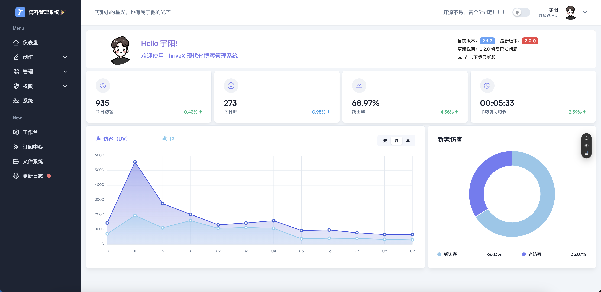
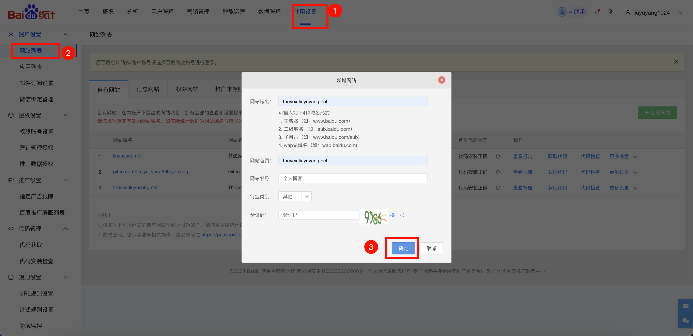
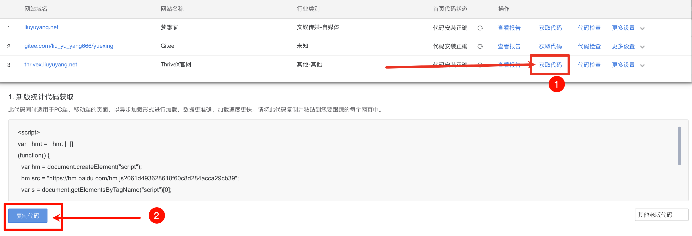
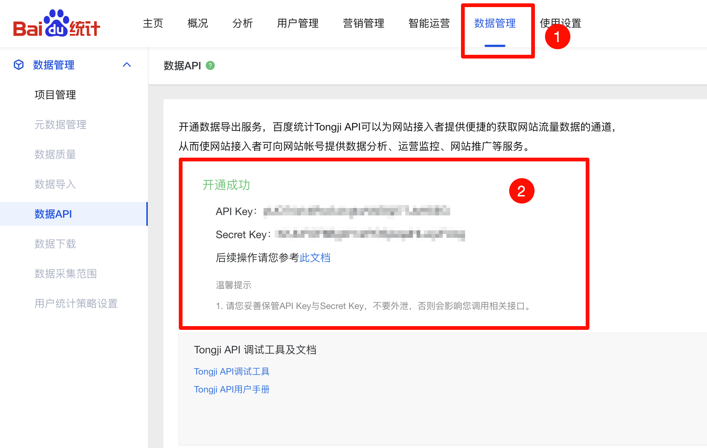

# 百度统计API

该  `API` 为可选的，主要应用于控制端（ThriveX-Admin）的数据统计。




## 一、注册百度统计

访问网站：https://tongji.baidu.com/


## 二、新增网站




## 三、配置前端

获取统计的代码




将刚刚复制的代码配置到自己的前端项目文件中，文件路径：`src/app/layout.tsx`


## 四、获取 Key 和秘钥

点击数据管理 -> 数据 `API` 申请即可

申请统计 `API` 的要求是网站访客要大于 `100`，大家可以想办法刷一下然后在申请




## 五、配置控制端

申请成功后，配置项目的控制端 `.env` 文件

```
VITE_BAIDU_TONGJI_SITE_ID=你的key
VITE_BAIDU_TONGJI_ACCESS_TOKEN=你的秘钥
```

