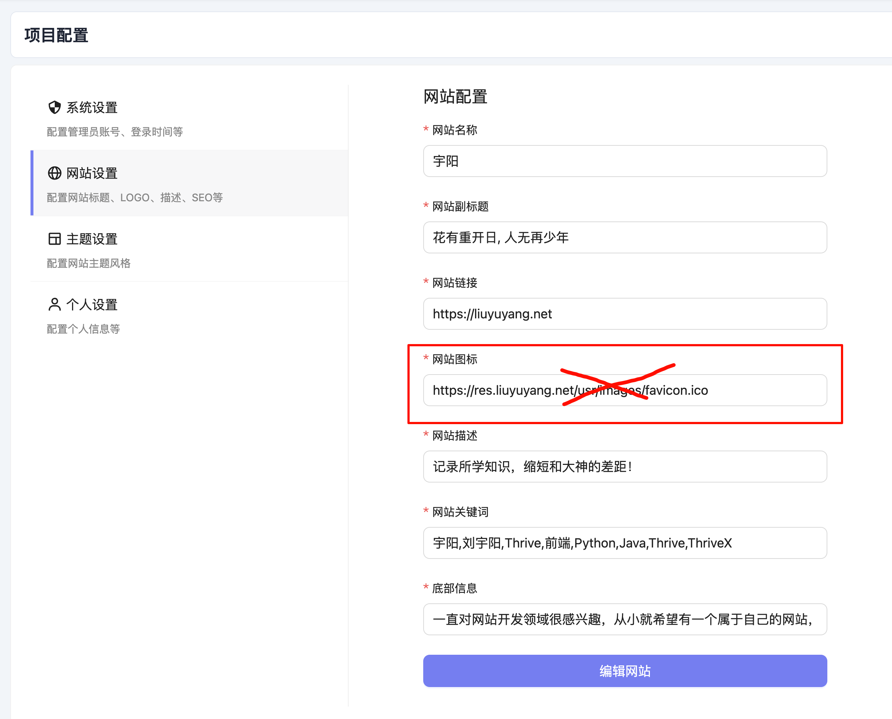
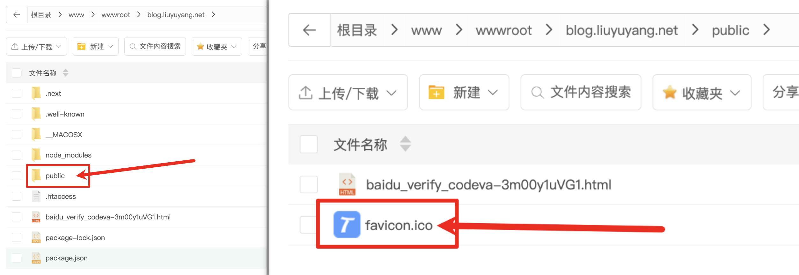

# 前端

## 修改 favicon.ico 

目前控制端修改网站图标存在一些问题，修改后前端不生效

大家暂时以这种方式修改

第一步、将图标转换为 `favicon.ico` 格式，可以在这个网站转换：https://www.bitbug.net/

第二步、在将前端项目根目录中的 `public` 目录中的 `favicon.ico` 图标替换

第三步、将 `public` 上传到服务器中，注意要与 `.next` 同级。

