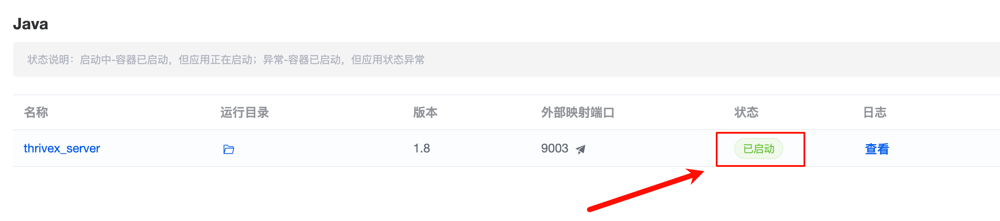
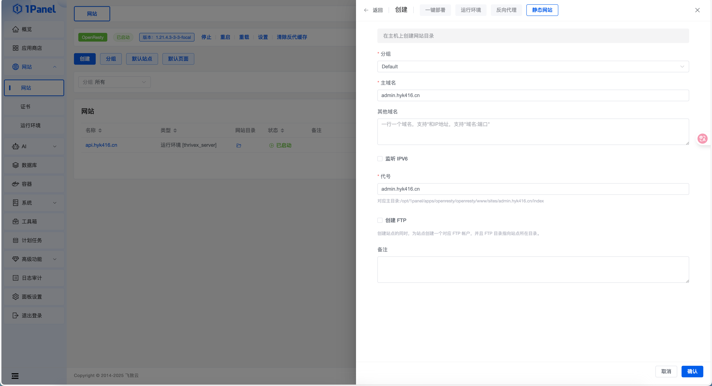
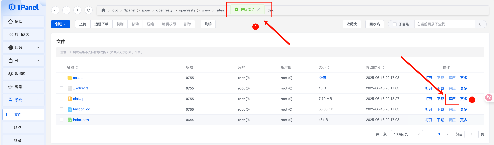

# 1Panel

## 准备工作

### 系统环境

**系统：** `Ubuntu 20.04`

**配置：** `2H4G` +


### 安装 1Panel

**安装文档：** https://1panel.cn/docs/v2/installation/online_installation/

**安装过程：**

```shell
 ██╗    ██████╗  █████╗ ███╗   ██╗███████╗██╗     
███║    ██╔══██╗██╔══██╗████╗  ██║██╔════╝██║     
╚██║    ██████╔╝███████║██╔██╗ ██║█████╗  ██║     
 ██║    ██╔═══╝ ██╔══██║██║╚██╗██║██╔══╝  ██║     
 ██║    ██║     ██║  ██║██║ ╚████║███████╗███████╗
 ╚═╝    ╚═╝     ╚═╝  ╚═╝╚═╝  ╚═══╝╚══════╝╚══════╝
[1Panel Log]: ======================= 开始安装 ======================= 
设置1Panel安装目录 (默认为/opt): 
[1Panel Log]: 您选择的安装路径是 /opt 
[1Panel Log]: ... 在线安装Docker 
[1Panel Log]: Docker安装成功 
Created symlink /etc/systemd/system/multi-user.target.wants/docker.service → /etc/systemd/system/docker.service.
设置1Panel端口 (默认是 11803):11803
[1Panel Log]: 您设置的端口是:  11803 
设置1Panel安全入口 (默认是 daab25c3fa): 
[1Panel Log]: 设置1Panel安全入口 (默认是 daab25c3fa 
设置1Panel面板用户 (默认是 3eeebb5afd): 
[1Panel Log]: 您设置的面板用户是 3eeebb5afd 
[1Panel Log]: 设置1Panel面板密码，设置后按回车键继续 (默认是 918712928a):  

[1Panel Log]: 正在配置1Panel服务 
Created symlink /etc/systemd/system/multi-user.target.wants/1panel.service → /etc/systemd/system/1panel.service.
[1Panel Log]: 正在启动1Panel服务 
[1Panel Log]: 1Panel服务已成功启动！ 
[1Panel Log]:  
[1Panel Log]: =================感谢您的耐心等待，安装已完成================== 
[1Panel Log]:  
[1Panel Log]: 请使用您的浏览器访问面板:  
[1Panel Log]: 外部地址:  http://117.50.197.159:11803/daab25c3fa 
[1Panel Log]: 内部地址:  http://10.60.211.244:11803/daab25c3fa 
[1Panel Log]: 面板用户:  3eeebb5afd 
[1Panel Log]: 面板密码:  918712928a 
[1Panel Log]:  
[1Panel Log]: 官方网站: https://1panel.cn 
[1Panel Log]: 项目文档: https://1panel.cn/docs 
[1Panel Log]: 代码仓库: https://github.com/1Panel-dev/1Panel 
[1Panel Log]: 前往 1Panel 官方论坛获取帮助: https://bbs.fit2cloud.com/c/1p/7 
[1Panel Log]:  
[1Panel Log]: 如果您使用的是云服务器，请在安全组中打开端口 11803 
[1Panel Log]:  
[1Panel Log]: 为了您的服务器安全，离开此屏幕后您将无法再次看到您的密码，请记住您的密码。 
[1Panel Log]:  
[1Panel Log]: ================================================================ 
ubuntu@10-60-211-244:/tmp/1panel-v1.10.29-lts-linux-amd64$ 
```

到这一步就安装成功了

如果外部地址无法访问就在相关平台给服务器安全组放行 `11803` 端口


### 服务器环境

进入到 `1Panel` 后，在应用商店中找到以下应用进行安装，注意版本号：

**openresty：** `1.21.4.3-3-3-focal`

**mysql：** `8.0.42`


## 进入主题

**部署顺序：** 后端、控制端、前端

当控制端和前端出现问题时，90%` 归根于后端，所以大家一定要按照顺序来！！！


### 后端

#### 下载源码

**下载 Jar 文件：** https://github.com/LiuYuYang01/ThriveX-Server/releases

选择最上面的最新版，然后找到 `Assets` 中的 `blog.jar` 点击下载


**下载 SQL 文件：** https://github.com/LiuYuYang01/ThriveX-Server/blob/master/ThriveX.sql


#### 配置环境变量

环境变量介绍

```env
PORT=自定义项目端口号
DB_INFO=数据库信息
DB_USERNAME=数据库用户名，一般是 root
DB_PASSWORD=数据库密码
EMAIL_HOST=邮箱服务器
EMAIL_PORT=邮箱服务器端口
EMAIL_USERNAME=邮箱用户名
EMAIL_PASSWORD=邮箱授权码（不是邮箱密码）
DOMAIN=你的域名
```

一段示例

```env
java -jar blog.jar --PORT=9003 --DB_INFO=mysql:3306/thrivex --DB_USERNAME=thrivex --DB_PASSWORD=xxxxxxxxxxxxxxxxxx --EMAIL_HOST=smtp.qq.com --EMAIL_PORT=465 --EMAIL_USERNAME=3311118881@qq.com --EMAIL_PASSWORD=abcdefg --DOMAIN=hyk416.cn
```


#### 创建数据库


#### 导入数据库

点击左侧菜单中的 数据库 选项后，在列表中找到刚刚创建的数据库，在右侧按钮中点击 **导入备份** 按钮弹出该界面 进行导入数据


#### 上传源码

在 `1Panel` 系统 / 文件中创建一个目录 `www/thrivex_server`，这个目录可以自定义

然后将刚刚下载的 `blog.jar` 上传到这个目录


#### 创建运行环境

4：注意版本要选择 `1.8` 别选错了

5：启动命令检查检查别填错了

7：端口默认都设置 `9003`

8：名称和容器名都可以自定义


创建成功后查看运行环境的状态是否为 **已启动**，如果是则表示截止目前为止一切顺利，否则请查看数据库密码、环境变量等是否正确



#### 创建网站

选择刚刚创建的运行环境，并绑定自己的域名


#### 配置 SSL

创建网站成功后，点击蓝色的网站名称进入到网站设置，选择 `HTTPS`，然后开启

配置自己的证书信息，证书大家自行想办法，网上有很多免费的


#### 验证是否成功

**访问：** https://api.hyk416.cn/doc.html#/home

选择用户登录接口进行测试

```json
{
  "password": "123456",
  "username": "admin"
}
```


当响应的 `code` 为 `200` 则表示一切顺利，后端部署成功 🎉🎉🎉


此刻你应该给自己鼓鼓掌 👏🏻👏🏻👏🏻


### 控制端

#### 下载源码

**下载 Zip 文件：** https://github.com/LiuYuYang01/ThriveX-Admin/releases

跟后端一样选择最上面的最新版，不同的是这次下载 `Source code` 这个文件


#### 配置环境变量

下载源码后用你熟悉的代码编辑器打开

随后执行 `npm i` 命令安装依赖，注意 `Nodejs` 版本要 `>=20` 

安装成功后项目根目录会出现 `node_modules` 目录

```
yang@MacBook-Air ThriveX-Admin % npm i

added 11 packages, changed 42 packages, and audited 726 packages in 2s

195 packages are looking for funding
  run `npm fund` for details

12 vulnerabilities (1 low, 8 moderate, 3 high)

To address all issues, run:
  npm audit fix

Run `npm audit` for details.
```


接下来后找到项目根目录中的 `.env` 文件，把相关信息改成自己的，注意后端域名协议必须是 `https`


#### 项目打包

配置好之后通过 `npm run build` 进行打包

```
yang@MacBook-Air ThriveX-Admin % npm run build

> thrivex-admin@2.0.0 build
> vite build

vite v4.5.2 building for production...
transforming (1) index.htmlBrowserslist: caniuse-lite is outdated. Please run:
  npx update-browserslist-db@latest
  Why you should do it regularly: https://github.com/browserslist/update-db#readme
src/components/Title/index.tsx (1:0) Error when using sourcemap for reporting an error: Can't resolve original location of error.
✓ 5779 modules transformed.
dist/index.html                                           0.46 kB │ gzip:     0.35 kB
dist/assets/comment-b1e5a1d5.svg                          1.82 kB │ gzip:     0.46 kB
dist/assets/group-a05fc271.svg                            2.00 kB │ gzip:     0.84 kB
dist/assets/message-b4b91f4d.svg                          3.06 kB │ gzip:     1.48 kB
dist/assets/file-554ac954.svg                             3.28 kB │ gzip:     1.24 kB
dist/assets/KaTeX_Size3-Regular-6ab6b62e.woff             4.42 kB
dist/assets/KaTeX_Size4-Regular-a4af7d41.woff2            4.93 kB
dist/assets/KaTeX_Size2-Regular-d04c5421.woff2            5.21 kB
dist/assets/KaTeX_Size1-Regular-6b47c401.woff2            5.47 kB
dist/assets/KaTeX_Size4-Regular-99f9c675.woff             5.98 kB
dist/assets/KaTeX_Size2-Regular-2014c523.woff             6.19 kB
dist/assets/KaTeX_Size1-Regular-c943cc98.woff             6.50 kB
dist/assets/KaTeX_Caligraphic-Regular-5d53e70a.woff2      6.91 kB
dist/assets/KaTeX_Caligraphic-Bold-de7701e4.woff2         6.91 kB
dist/assets/KaTeX_Size3-Regular-500e04d5.ttf              7.59 kB
dist/assets/KaTeX_Caligraphic-Regular-3398dd02.woff       7.66 kB
dist/assets/KaTeX_Caligraphic-Bold-1ae6bd74.woff          7.72 kB
dist/assets/KaTeX_Script-Regular-036d4e95.woff2           9.64 kB
dist/assets/KaTeX_SansSerif-Regular-68e8c73e.woff2       10.34 kB
dist/assets/KaTeX_Size4-Regular-c647367d.ttf             10.36 kB
dist/assets/KaTeX_Script-Regular-d96cdf2b.woff           10.59 kB
dist/assets/KaTeX_Fraktur-Regular-51814d27.woff2         11.32 kB
dist/assets/KaTeX_Fraktur-Bold-74444efd.woff2            11.35 kB
dist/assets/KaTeX_Size2-Regular-a6b2099f.ttf             11.51 kB
dist/assets/KaTeX_SansSerif-Italic-00b26ac8.woff2        12.03 kB
dist/assets/KaTeX_SansSerif-Bold-e99ae511.woff2          12.22 kB
dist/assets/KaTeX_Size1-Regular-95b6d2f1.ttf             12.23 kB
dist/assets/KaTeX_SansSerif-Regular-11e4dc8a.woff        12.32 kB
dist/assets/KaTeX_Caligraphic-Regular-ed0b7437.ttf       12.34 kB
dist/assets/KaTeX_Caligraphic-Bold-07d8e303.ttf          12.37 kB
dist/assets/KaTeX_Fraktur-Regular-5e28753b.woff          13.21 kB
dist/assets/KaTeX_Fraktur-Bold-9be7ceb8.woff             13.30 kB
dist/assets/KaTeX_Typewriter-Regular-71d517d6.woff2      13.57 kB
dist/assets/KaTeX_SansSerif-Italic-91ee6750.woff         14.11 kB
dist/assets/KaTeX_SansSerif-Bold-ece03cfd.woff           14.41 kB
dist/assets/link-3ed1d17a.svg                            14.68 kB │ gzip:     6.58 kB
dist/assets/KaTeX_Typewriter-Regular-e14fed02.woff       16.03 kB
dist/assets/KaTeX_Math-BoldItalic-dc47344d.woff2         16.40 kB
dist/assets/KaTeX_Math-Italic-7af58c5e.woff2             16.44 kB
dist/assets/KaTeX_Script-Regular-1c67f068.ttf            16.65 kB
dist/assets/KaTeX_Main-BoldItalic-99cd42a3.woff2         16.78 kB
dist/assets/logo-c895977c.png                            16.94 kB
dist/assets/KaTeX_Main-Italic-97479ca6.woff2             16.99 kB
dist/assets/KaTeX_Math-BoldItalic-850c0af5.woff          18.67 kB
dist/assets/KaTeX_Math-Italic-8a8d2445.woff              18.75 kB
dist/assets/KaTeX_Main-BoldItalic-a6f7ec0d.woff          19.41 kB
dist/assets/KaTeX_SansSerif-Regular-f36ea897.ttf         19.44 kB
dist/assets/KaTeX_Fraktur-Regular-1e6f9579.ttf           19.57 kB
dist/assets/KaTeX_Fraktur-Bold-9163df9c.ttf              19.58 kB
dist/assets/KaTeX_Main-Italic-f1d6ef86.woff              19.68 kB
dist/assets/KaTeX_SansSerif-Italic-3931dd81.ttf          22.36 kB
dist/assets/Satoshi-Light-8a24f395.woff2                 22.80 kB
dist/assets/Satoshi-LightItalic-9690a557.woff2           23.41 kB
dist/assets/Satoshi-Black-bd11b582.woff2                 23.48 kB
dist/assets/empty-4119fad2.svg                           24.18 kB │ gzip:     4.26 kB
dist/assets/Satoshi-BlackItalic-83d61d67.woff2           24.28 kB
dist/assets/KaTeX_SansSerif-Bold-1ece03f7.ttf            24.50 kB
dist/assets/KaTeX_Main-Bold-0f60d1b8.woff2               25.32 kB
dist/assets/Satoshi-Bold-353a7fbf.woff2                  25.33 kB
dist/assets/Satoshi-Regular-50dca57f.woff2               25.52 kB
dist/assets/Satoshi-Medium-af02a722.woff2                25.60 kB
dist/assets/KaTeX_Main-Regular-c2342cd8.woff2            26.27 kB
dist/assets/Satoshi-BoldItalic-52bfd9e8.woff2            26.30 kB
dist/assets/Satoshi-Italic-dbcb8c32.woff2                26.46 kB
dist/assets/Satoshi-MediumItalic-beb15382.woff2          26.70 kB
dist/assets/KaTeX_Typewriter-Regular-f01f3e87.ttf        27.56 kB
dist/assets/KaTeX_AMS-Regular-0cdd387c.woff2             28.08 kB
dist/assets/Satoshi-Light-dd42e743.woff                  29.28 kB
dist/assets/KaTeX_Main-Bold-c76c5d69.woff                29.91 kB
dist/assets/Satoshi-LightItalic-2f9c5264.woff            30.34 kB
dist/assets/Satoshi-Black-a849a7b7.woff                  30.38 kB
dist/assets/KaTeX_Main-Regular-c6368d87.woff             30.77 kB
dist/assets/KaTeX_Math-BoldItalic-f9377ab0.ttf           31.20 kB
dist/assets/KaTeX_Math-Italic-08ce98e5.ttf               31.31 kB
dist/assets/Satoshi-BlackItalic-cf5edac8.woff            31.36 kB
dist/assets/KaTeX_Main-BoldItalic-70ee1f64.ttf           32.97 kB
dist/assets/Satoshi-Bold-1789917c.woff                   32.97 kB
dist/assets/Satoshi-Regular-9fbc41c9.woff                33.02 kB
dist/assets/Satoshi-Medium-7aeaf037.woff                 33.27 kB
dist/assets/KaTeX_AMS-Regular-30da91e8.woff              33.52 kB
dist/assets/KaTeX_Main-Italic-0d85ae7c.ttf               33.58 kB
dist/assets/Satoshi-Italic-a6df1710.woff                 34.34 kB
dist/assets/Satoshi-BoldItalic-5d73878e.woff             34.34 kB
dist/assets/Satoshi-MediumItalic-cf98a3ed.woff           34.58 kB
dist/assets/KaTeX_Main-Bold-138ac28d.ttf                 51.34 kB
dist/assets/KaTeX_Main-Regular-d0332f52.ttf              53.58 kB
dist/assets/KaTeX_AMS-Regular-68534840.ttf               63.63 kB
dist/assets/Satoshi-Light-b54cf060.ttf                   71.68 kB
dist/assets/Satoshi-Black-78edaca6.ttf                   73.18 kB
dist/assets/Satoshi-Bold-2c122eab.ttf                    73.37 kB
dist/assets/Satoshi-Regular-243b23f6.ttf                 73.48 kB
dist/assets/Satoshi-Medium-7130cef6.ttf                  73.76 kB
dist/assets/Satoshi-LightItalic-c9a8d027.ttf             75.40 kB
dist/assets/Satoshi-BlackItalic-d3d6c8d6.ttf             75.76 kB
dist/assets/Satoshi-BoldItalic-8ff85a17.ttf              76.45 kB
dist/assets/Satoshi-Italic-14c3d259.ttf                  76.60 kB
dist/assets/Satoshi-MediumItalic-71f8dce5.ttf            76.70 kB
dist/assets/waterfall-5c0f1ee1.png                    1,362.24 kB
dist/assets/classics-e3f7ea8e.png                     1,622.53 kB
dist/assets/card-6719c3af.png                         1,747.87 kB
dist/assets/index-9f6a09b7.css                          136.79 kB │ gzip:    28.70 kB
dist/assets/katex-9a88bd85.js                           262.45 kB │ gzip:    77.39 kB
dist/assets/index-26c89ade.js                           928.55 kB │ gzip:   308.63 kB
dist/assets/index-39f948cc.js                         3,853.54 kB │ gzip: 1,190.60 kB

(!) Some chunks are larger than 500 kBs after minification. Consider:
- Using dynamic import() to code-split the application
- Use build.rollupOptions.output.manualChunks to improve chunking: https://rollupjs.org/configuration-options/#output-manualchunks
- Adjust chunk size limit for this warning via build.chunkSizeWarningLimit.
✓ built in 10.70s
```

打包完成后，你的项目根目录就会新增一个 `dist` 目录

接下来我们需要将 `dist` 目录中的文件压缩为 `.zip` 格式，待会要上传到服务器


#### 创建网站




#### 配置 SSL

配置方法跟后端一样，通用的


#### 上传源码

点击进入到网站对应的目录，然后当前默认的文件都删掉


上传刚刚打包后的 `dist` 文件


上传完成后解压刚刚上传的 `dist.zip` 压缩包




#### 解决刷新 404 

单页面项目都会存在一种问题，第一次进入页面是正常的，但在刷新时候会导致 `404`，我们可以通过以下方式解决


复制粘贴到配置中

```nginx
location / {
	index index.html index.htm;
  try_files $uri $uri/ /index.html; 
}
```


#### 验证是否成功

**访问：** https://admin.hyk416.cn/ 进行登录

**账号：** admin   |   **密码：** 123456

只要后端没问题，前端和控制端基本上不会出问题

如果登录成功则表示控制端部署成功 🎉🎉🎉

此刻你应该给自己鼓鼓掌 👏🏻👏🏻👏🏻


### 前端

#### 下载源码

**下载 Zip 文件：** https://github.com/LiuYuYang01/ThriveX-Blog/releases

跟控制端一样下载 `Source code` 这个文件


#### 配置环境变量

安装依赖和打包命令都与控制端一致，唯一不同的是控制端打包后会生成一个 `dist` 目录，而前端生成的是 `.next` 目录。

它们的作用都是一样的，待会我们需要这些目录上传到服务器


#### 上传源码

将这些文件压缩，准备上传到服务器


在 `1Panel` 系统 / 文件中创建一个目录 `www/thrivex_blog`，然后将刚刚压缩的文件上传到这里并解压


解压之后的结构


#### 创建运行环境

`Nodejs` 版本选择 `20`，镜像源选择淘宝的


如果这里状态为 **已启动**，则表示截止目前为止一切顺利


#### 创建网站


#### 配置 SSL

配置方法跟后端一样，请网上看


#### 验证是否成功

**访问：** https://hyk416.cn/

只要后端没问题，前端和控制端基本上不会出问题

到这一步你就完成了整个项目的部署 🎉🎉🎉

此刻你应该给自己热烈的掌声 👏🏻👏🏻👏🏻


## 技术支持

如果在部署过程中遇到了问题，可以选择付费，每个问题 `20` 元，不议价，当然不提倡这种方式。

**推荐：** 将下面 `3` 个地址分别打开，在右侧 **三连** + **关注** 截图发给我即可获得一次免费问题答疑服务

**微信：** `liuyuyang2023`  **备注：** 技术支持

| 项目   | 地址                                                         |
| ------ | ------------------------------------------------------------ |
| 前端   | [LiuYuYang01/ThriveX-Blog (github.com)](https://github.com/LiuYuYang01/ThriveX-Blog) |
| 控制端 | [LiuYuYang01/ThriveX-Admin (github.com)](https://github.com/LiuYuYang01/ThriveX-Admin) |
| 后端   | [LiuYuYang01/ThriveX-Server (github.com)](https://github.com/LiuYuYang01/ThriveX-Server) |


## 官方交流群

大家在部署时遇到任何问题欢迎加入官方交流群进行探索

**加微信：** `liuyuyang2023`   **记得备注：** 拉群


## 版权声明

为了项目的生态越来越强大，作者在这里恳请大家保留 `ThriveX` 博客系统版权

在项目 `Star` 突破 `2K` 后大家可自由选择删除 `or` 保留

如果对该项目进行二次开发，最终需将项目进行开源并保留版权 且 禁止任何商业行为

最后希望大家能够请遵守开源协议：***\*AGPL-3.0 license\**** 

弘扬开源精神，从你我做起！