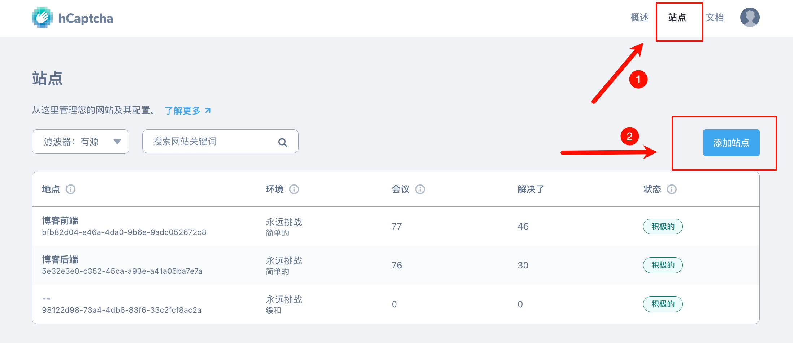
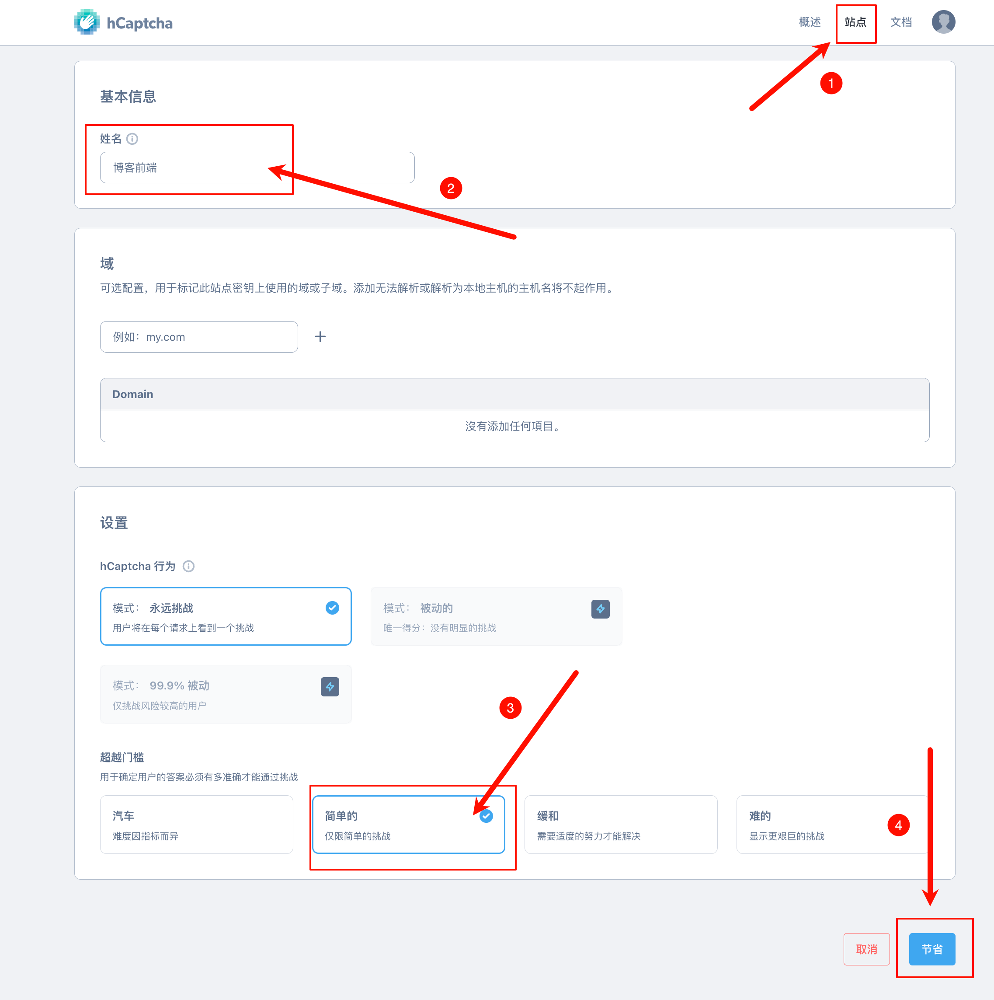
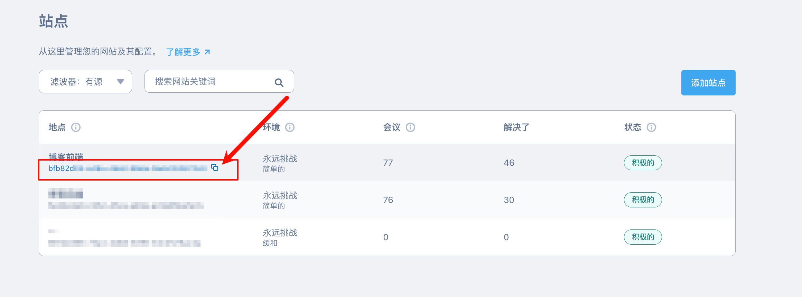
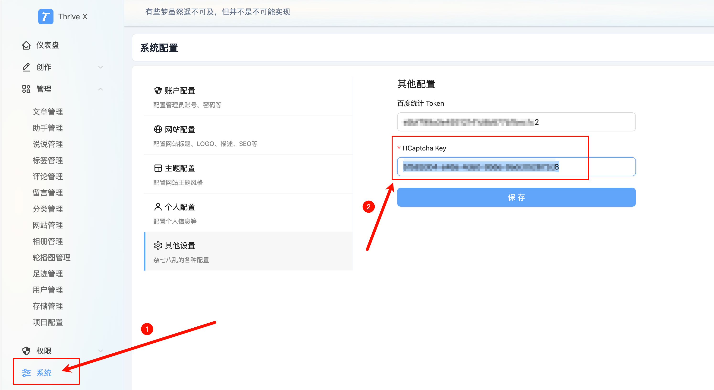

# 人机验证

用于前端（ThriveX-Blog）的评论、友联、留言的人机验证，防止用户恶意提交垃圾数据

下面是功能演示：

大家可以根据如下步骤申请 `key` 和 秘钥

## 一、注册人机验证账号

访问：https://dashboard.hcaptcha.com/login 注册并登录

## 二、添加站点

## 三、拿到 Key

复制粘贴

## 四、在控制端配置

## 五、后续

目前只是前端增加了人机验证，后端暂时还没加，有时间了我会补充该文档的后端配置。目前的配置不影响使用