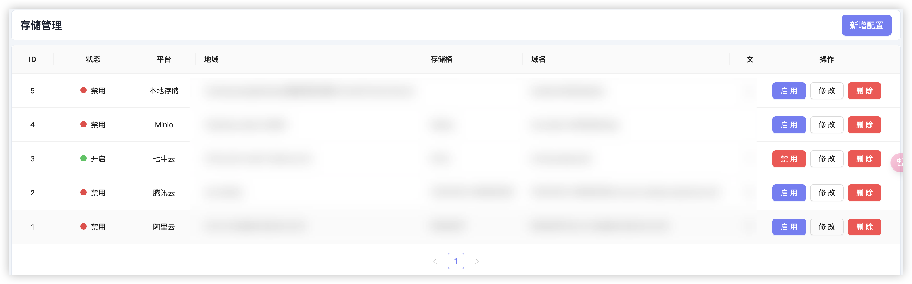
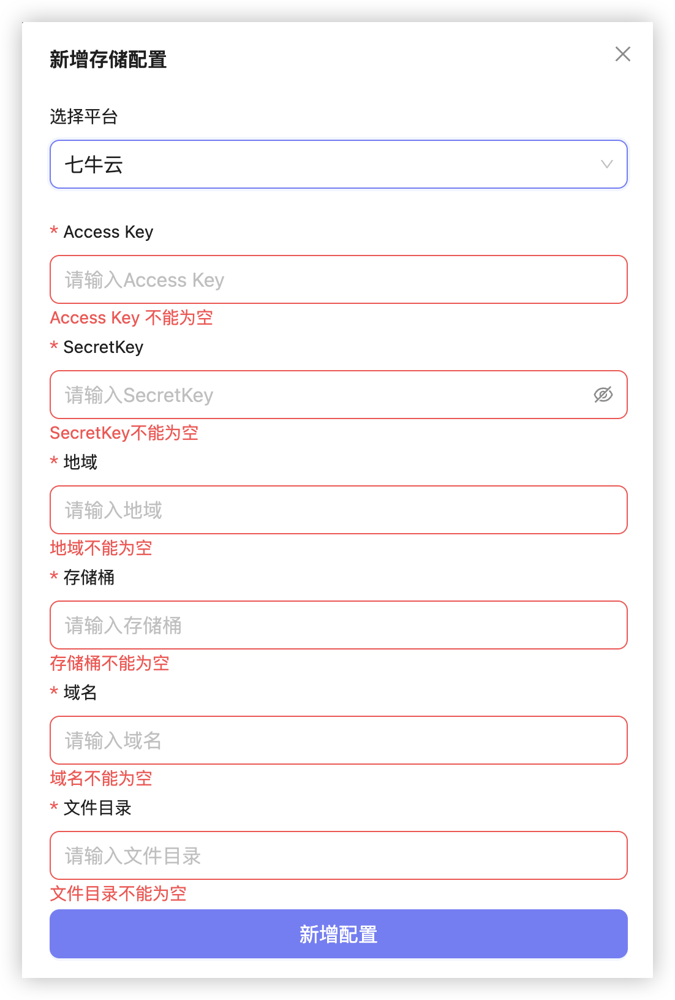
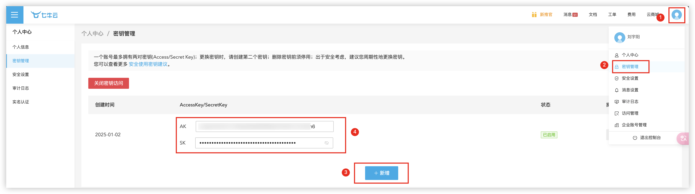
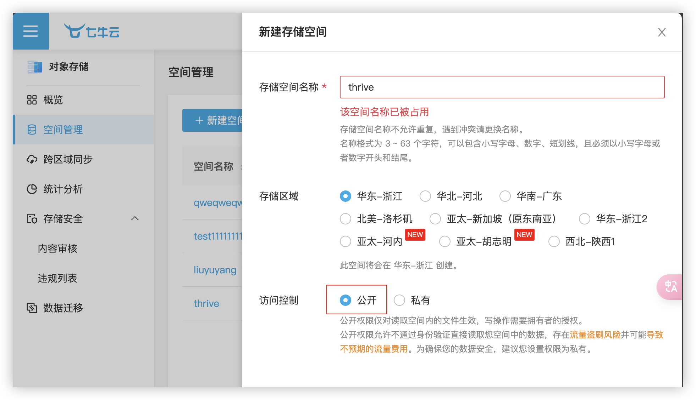
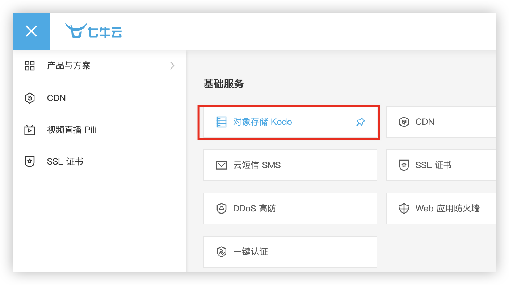
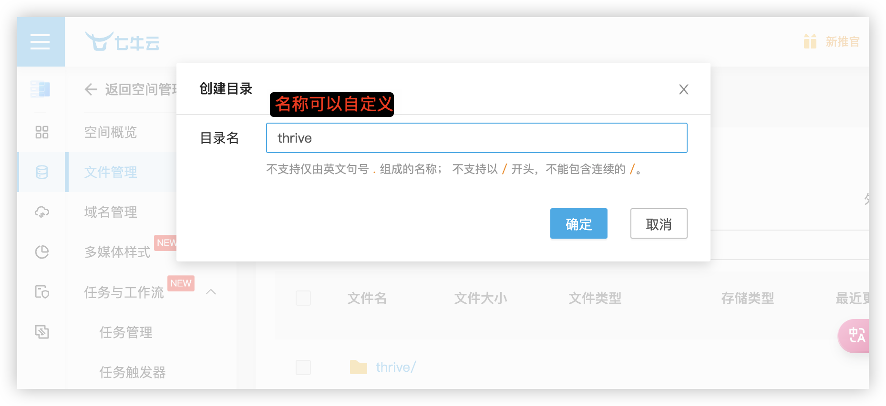
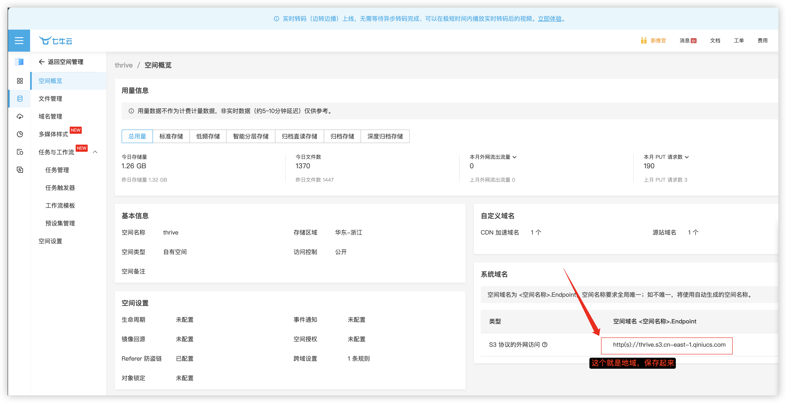
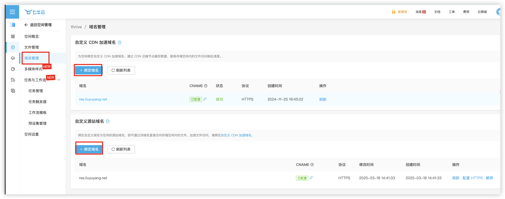
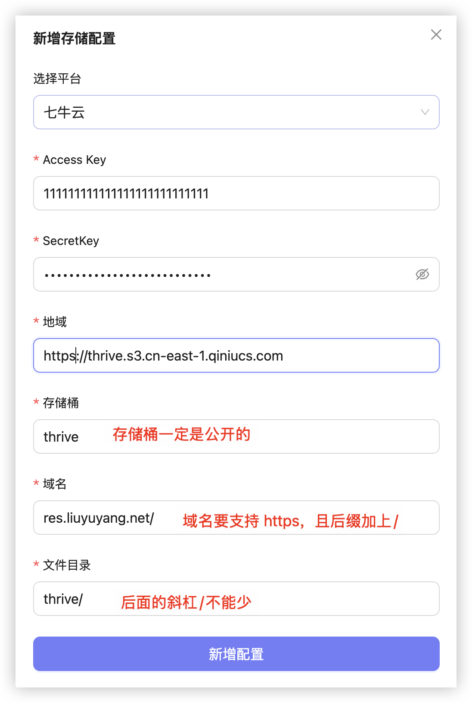

# 对象存储

该功能主要针对整个项目的文件存储，你可以自由选择多种主流平台的存储方式

注意，本地存储暂时有点问题，切勿使用

## 配置教程

所有平台配置都是大差不差的，这里就拿七牛云举例

我们需要以下信息

**获取 `Access Key` 和 `Secret Key`** 

首先进入到后台，点击右上角头像，然后点击秘钥，再点击新增即可

**创建存储桶**

**创建文件目录**

**获取地域**

**绑定域名**

**最终配置如下：**

## 注意事项

1、所有域名必须使用 `https` 包括前端、后端、控制端

2、域名和文件目录后缀一定要加上斜杠 `/`

3、存储桶必须是公开的
