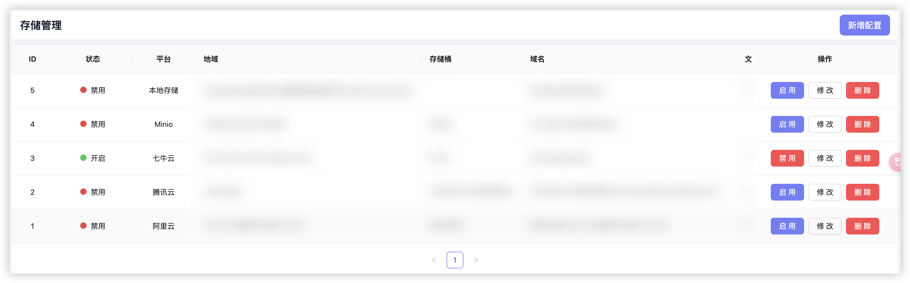
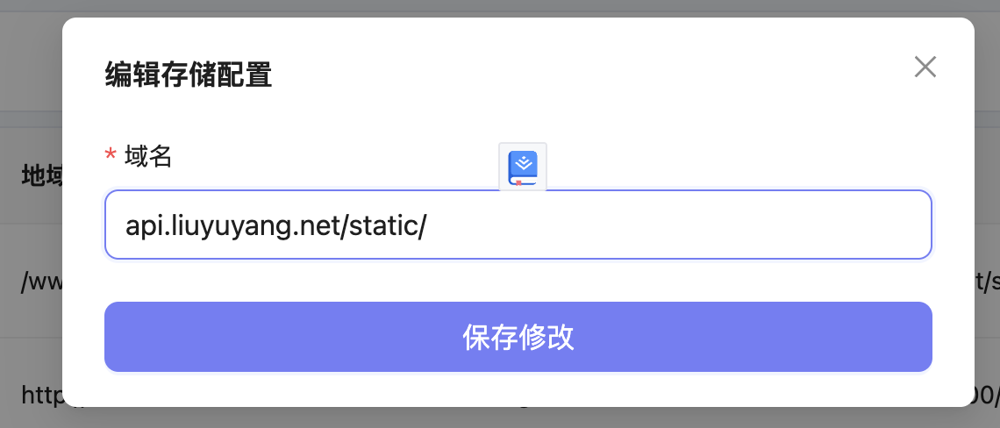
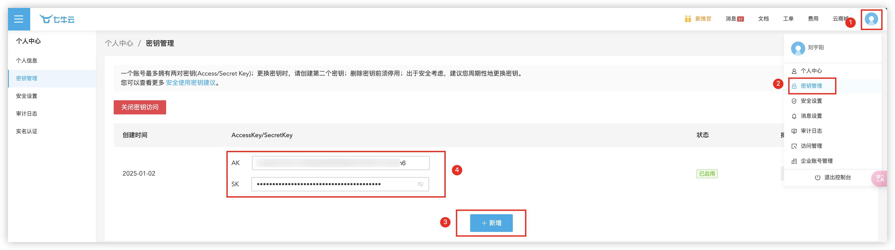
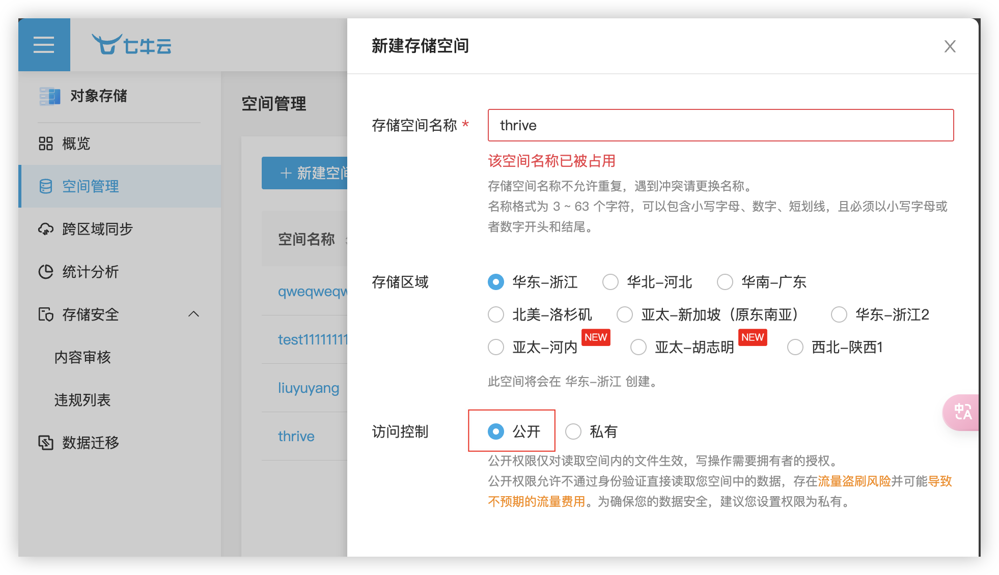
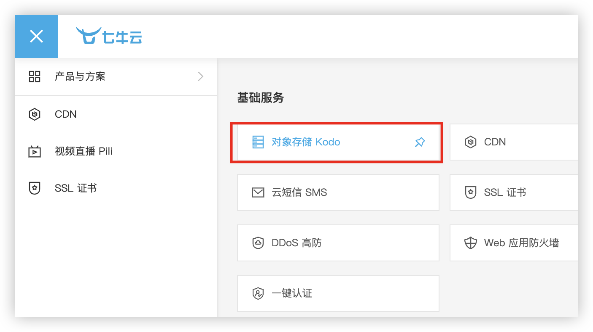
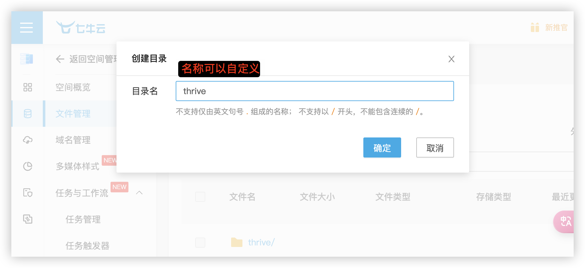
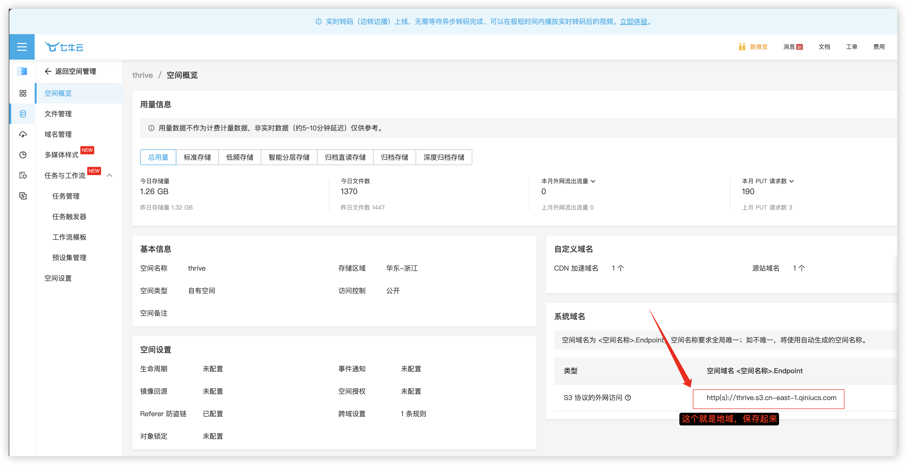
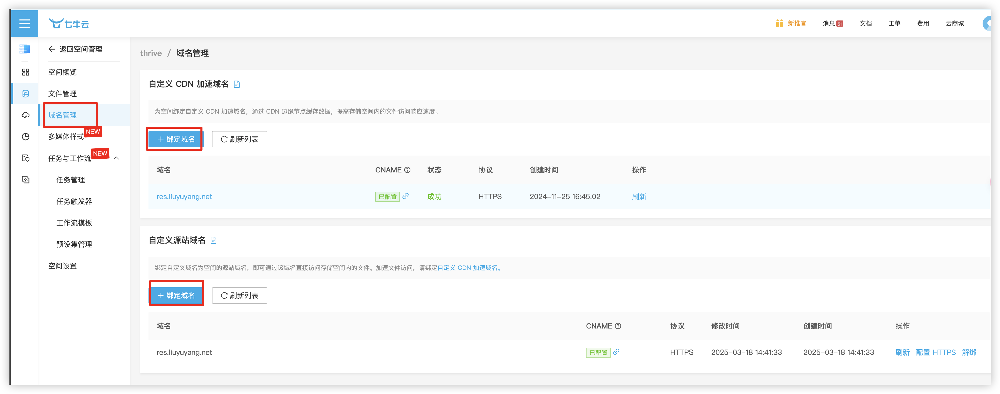
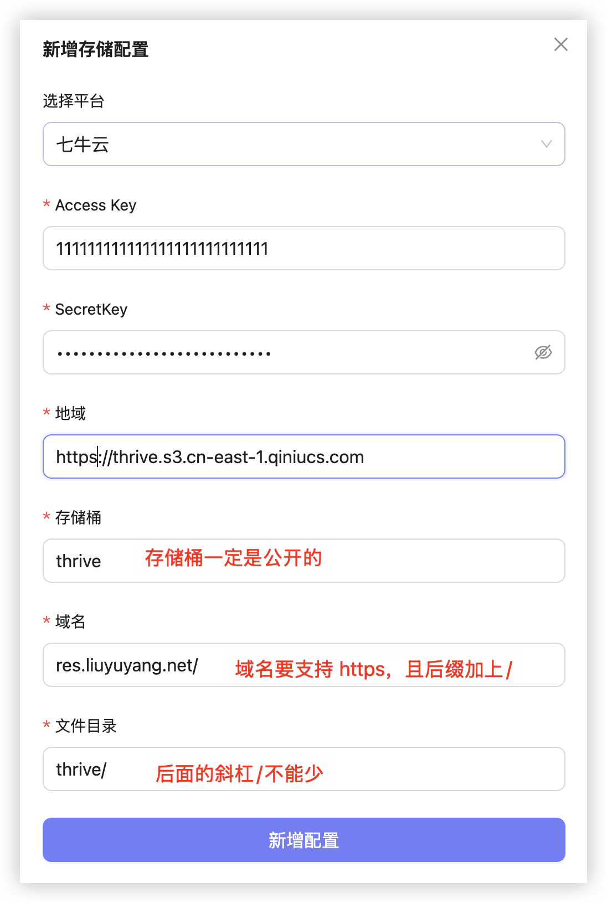

# 对象存储

对象存储用于保存图片和附件，比如文章封面、说说图片、轮播图、足迹图片等。

正式站点建议使用第三方对象存储，访问更稳定，也方便后期迁移。



## 字段说明

| 字段 | 填什么 | 示例 |
| --- | --- | --- |
| Access Key | 平台访问 Key | `xLzpxTtN94h8Q9Z31885355` |
| Secret Key | 平台私密 Key | `nQw7qx3g6fQkYnL096M1gfwegw` |
| 访问域名 | 文件访问域名 | `https://img.example.com` |
| 存储桶 | Bucket 名称 | `thrivex` |
| 地域 | Endpoint | `s3.cn-east-1.qiniucs.com` |
| 根目录 | 文件目录 | `static` |

## 本地存储

本地存储适合测试。配置时注意：

1. 域名改成当前项目域名。
2. 前缀不要加 `http`。
3. 后缀要加 `/static/`。



## 七牛云配置

### 1. 获取密钥

进入七牛云后台，点击右上角头像，进入 **密钥管理**，获取：

- Access Key
- Secret Key



### 2. 创建存储桶

进入对象存储，创建空间 / 存储桶。



建议：

- 名称使用英文，如 `thrivex`。
- 访问控制选择公开读。
- 区域选择离服务器或用户近的区域。

### 3. 创建目录

在存储桶中创建目录，比如 `static`。





ThriveX 的 **根目录** 填：

```text
static
```

### 4. 获取地域

在存储桶详情中找到 Endpoint。



示例：

```text
s3.cn-east-1.qiniucs.com
```

地域必须和存储桶所在区域一致。

### 5. 绑定域名

绑定自己的访问域名，或使用平台默认域名。



建议使用 HTTPS，例如：

```text
https://img.example.com
```

### 6. 填入 ThriveX



| ThriveX 字段 | 七牛云对应项 |
| --- | --- |
| Access Key | 密钥管理里的 Access Key |
| Secret Key | 密钥管理里的 Secret Key |
| 访问域名 | 绑定域名或默认域名 |
| 存储桶 | 空间 / Bucket 名称 |
| 地域 | Endpoint |
| 根目录 | 目录名，如 `static` |

## 测试方法

保存配置后，到 **文件系统** 上传一张图片，复制图片地址到浏览器打开。

能正常打开，说明配置基本没问题。

## 常见问题

### 图片打不开

检查存储桶是否公开读、访问域名是否正确、HTTPS 是否正常、根目录是否填错。

### 密钥错误

检查是否复制了多余空格，密钥是否被禁用，账号是否对应当前存储桶。

### 地域填什么

填 Endpoint，不是中文区域名。

正确示例：

```text
s3.cn-east-1.qiniucs.com
```

### 根目录要不要斜杠

第三方存储建议填：

```text
static
```

不要填 `/static/`。

## 注意事项

1. 正式环境建议全部使用 HTTPS。
2. 存储桶必须允许公开读取。
3. Access Key 和 Secret Key 不要泄露。
4. 改完配置后先上传图片测试。