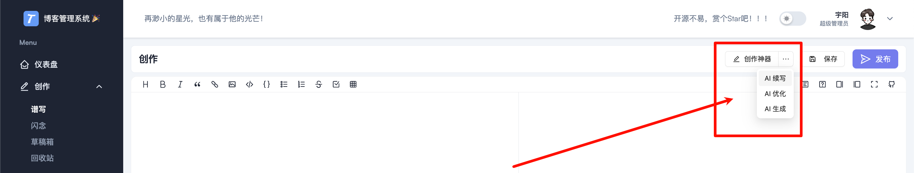
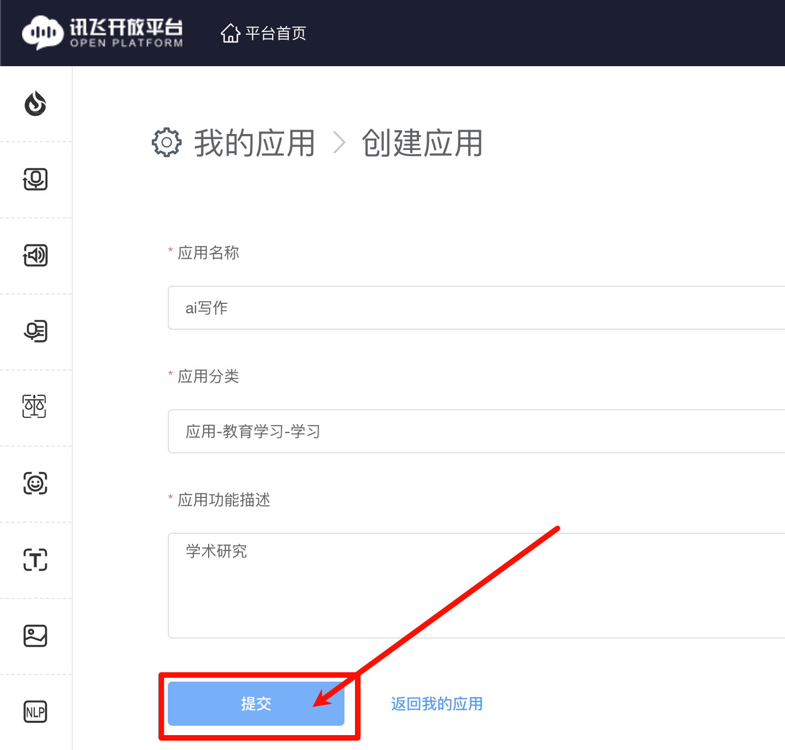
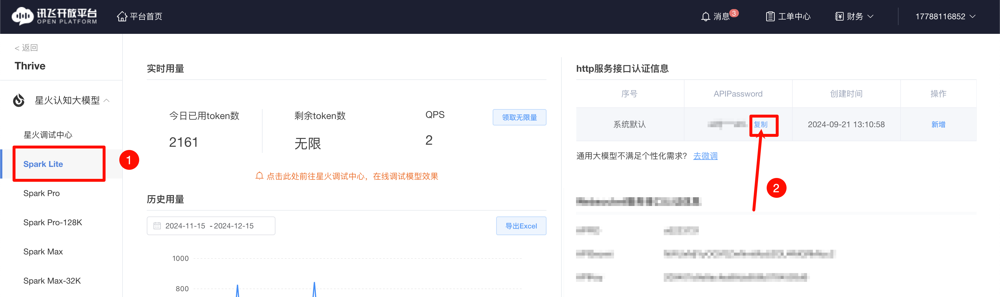

# 星火大模型

该功能为可选的，主要应用于控制端（ThriveX-Admin）的创作效率。

下面是功能示列：




## 一、注册星火大模型

访问网站：https://www.xfyun.cn/  注册并登录


## 二、创建应用

注册成功后点击控制台 -> 创建新应用




点击应用的名称


## 三、获取秘钥

选择 `Spark Lite`，别选错了



因为 `Lite` 是免费版本，所以建议大家选择这个。如果大家想选择其他更强的版本可以参考如下自由选择

**指定访问的模型版本:**
`lite` 指向 `Lite` 版本;
`generalv3` 指向 `Pro` 版本;
`pro-128k` 指向 `Pro-128K` 版本;
`generalv3.5` 指向 `Max` 版本;
`max-32k` 指向 `Max-32K` 版本;
`4.0Ultra` 指向 `4.0 Ultra` 版本;


## 四、配置控制端环境变量

配置控制端 `.env` 环境变量文件

```
VITE_AI_APIPassword=刚刚复制的秘钥
VITE_AI_MODEL=lite # 这里我选择的是 Lite 免费版
```

