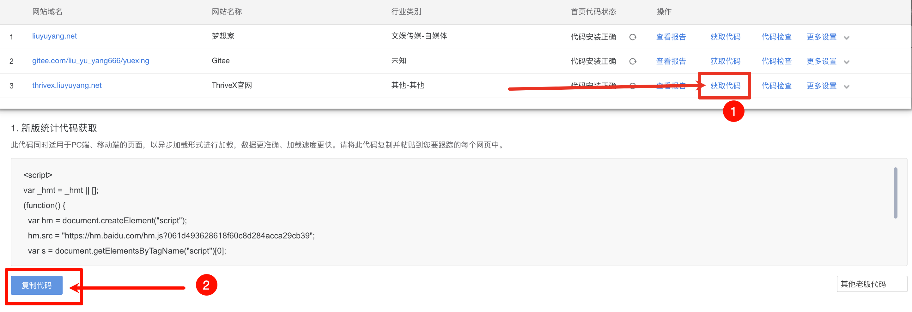
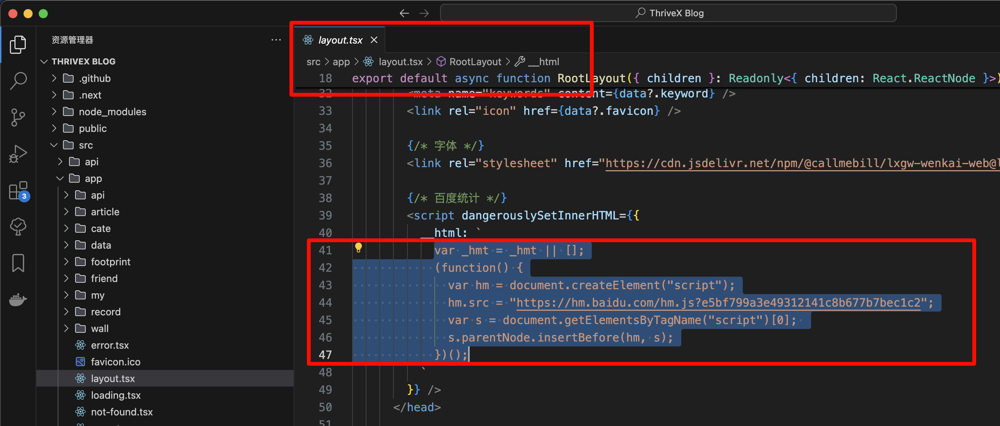

# 百度统计

该功能为可选的，主要应用于控制端（ThriveX-Admin）的数据统计。

下面是功能示列：


## 一、注册百度统计

访问网站：https://tongji.baidu.com/  注册并登录


## 二、新增网站


## 三、配置前端

获取统计的代码




将刚刚复制的代码配置到自己的前端项目文件中，文件路径：`src/app/layout.tsx`




## 四、获取 Key 和秘钥

点击数据管理 -> 数据 `API` 申请即可

申请统计 `API` 的要求是网站访客要大于 `100`，大家可以想办法刷一下然后在申请


## 五、获取相关信息

下一步查看官方文档：https://tongji.baidu.com/api/manual/Chapter2/openapi.html

得到如下数据结构，我们只需要拿到 `access_token`
```json
{
    "expires_in": 2592000,
    "refresh_token":"2.385d55f8615fdfd9edb7c4b5ebdc3e39.604800.1293440400-2346678-124328",
    "access_token":"1.a6b7dbd428f731035f771b8d15063f61.86400.1292922000-2346678-124328",
    "session_secret":"ANXxSNjwQDugf8615OnqeikRMu2bKaXCdlLxn",
    "session_key":" 248APxvxjCZ0VEC43EYrvxqaK4oZExMB",
    "scope":"basic"
}
```


访问网站在线调试获取站点ID：https://tongji.baidu.com/api/debug/#


得到如下数据结构，我们只需要拿到 `site_id` 即可

```
{
	"list": [
		{
			"site_id": 17250000,
			"domain": "liuyuyang.net",
			"status": 0,
			"create_time": "2021-09-26 20:32:39",
			"sub_dir_list": []
		}
	]
} 
```


## 六、配置控制端

申请成功后，配置项目的控制端 `.env` 文件

```
VITE_BAIDU_TONGJI_SITE_ID=站点id（site_id）
VITE_BAIDU_TONGJI_ACCESS_TOKEN=秘钥（access_token）
```

