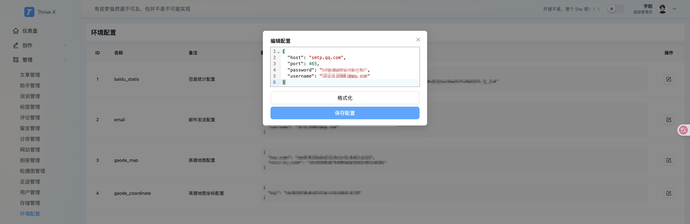

# 邮件提醒

用于后端（ThriveX-Server）的邮箱提醒，比如别人对你的网站发布了评论会通过邮件方式提醒到你，当你回复了对方的评论，也会通过邮件提醒到对方。

下面是功能示列：


## 一、获取授权码

就拿 `QQ` 邮箱举例，访问网站：https://mail.qq.com/  登录自己的邮箱，然后点击顶部设置 -> 账号 -> 获取授权码


## 二、项目配置

将这些信息改成你自己的，然后在控制端环境配置中找到 `email` 配置项，编辑配置并保存

```json
{
  "host": "smtp.qq.com",
  "port": 465,
  "username": "你的邮箱",
  "password": "刚刚获取的邮箱授权码"
}
```


