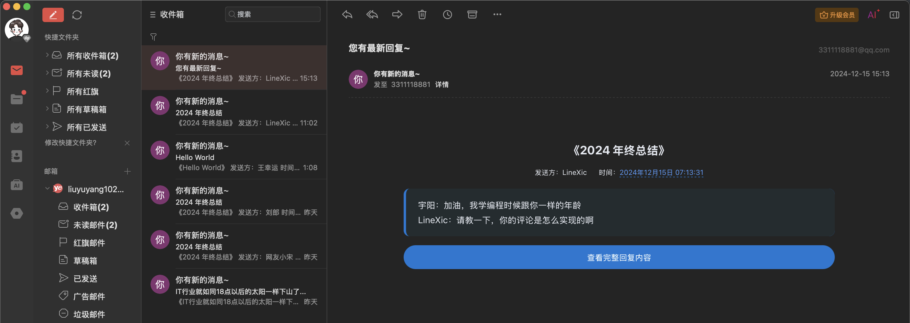

# 邮件提醒

该配置为 **必选** 的，主要作用是后端（ThriveX-Server）的邮箱提醒，比如别人对你的网站发布了评论会通过邮件方式提醒到你，当你回复了对方的评论，也会通过邮件提醒到对方。

下面是功能示列：




## 一、获取授权码

就拿 `QQ` 邮箱举例，访问网站：https://mail.qq.com/  登录自己的邮箱，然后点击顶部设置 -> 账号 -> 获取授权码


## 二、配置后端邮箱提醒

**1. 通过 `jar` 包运行：**

```
java -jar blog.jar \
--DB_NAME=数据库名称 \
--DB_USERNAME=数据库用户名，一般root \
--DB_PASSWORD=数据库密码 \

--EMAIL_HOST=smtp.qq.com \
--EMAIL_PORT=465 \
--EMAIL_USERNAME=3311118881@qq.com \
--EMAIL_PASSWORD=刚刚获取的邮箱授权码 \

--OSS_ACCESS_KEY=七牛云ACCESS \
--OSS_SECRET_KEY=七牛云SECRET \
--OSS_BUCKET=七牛云存储桶
```

其他的配置也是必选的，但这里只演示邮箱配置的


**2. 如果你在编辑器运行，那么直接更改配置文件**

配置文件路径：`ThriveX-Server/blog/src/main/resources/application-pro.yml`

```yml
lyy:
  email:
    host: ${EMAIL_HOST}
    port: ${EMAIL_PORT}
    username: ${EMAIL_USERNAME}
    password: ${EMAIL_PASSWORD}
```

把上述的信息改为：

```yml
lyy:
  email:
    host: smtp.qq.com
    port: 465
    username: 你的邮箱
    password: 刚刚获取的邮箱授权码
```


