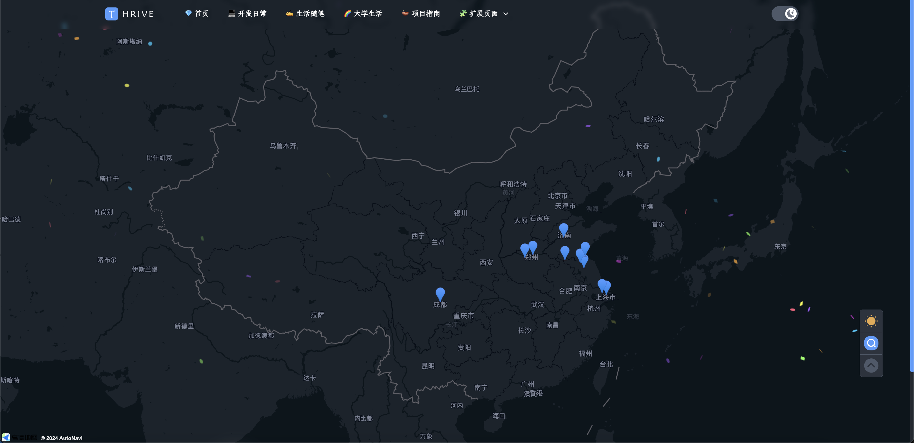

# 高德地图

该功能为可选的，主要应用于前端（ThriveX-Blog）的足迹地图展示。

下面是功能示列：



大家可以根据如下步骤申请 `key` 和 秘钥


## 一、登录控制台

登录 [高德开放平台控制台](https://console.amap.com/)，如果没有开发者账号，请 [注册开发者](https://console.amap.com/dev/id)。


## 二、创建 key

进入**应用管理**，**创建新应用，**新应用中**添加** key，服务平台选择 **Web端(JS API)。**


## 三、获取 key 和密钥

创建成功后，可获取 **key** 和**安全密钥**。


## 四、配置环境变量

在 `.env` 文件中配置刚刚获取到的 `key` 和秘钥

```
NEXT_PUBLIC_GAODE_KEY_CODE=你的key
NEXT_PUBLIC_GAODE_SECURITYJS_CODE=你的秘钥
```

