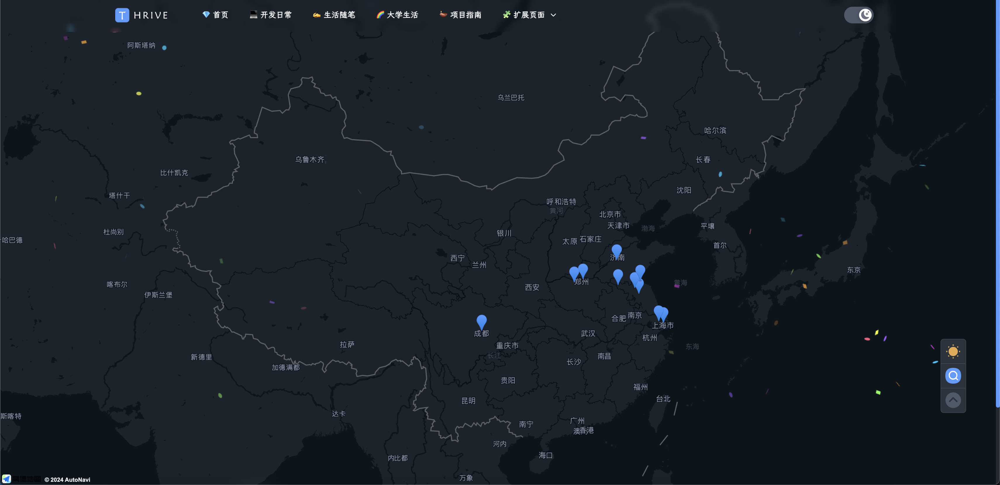
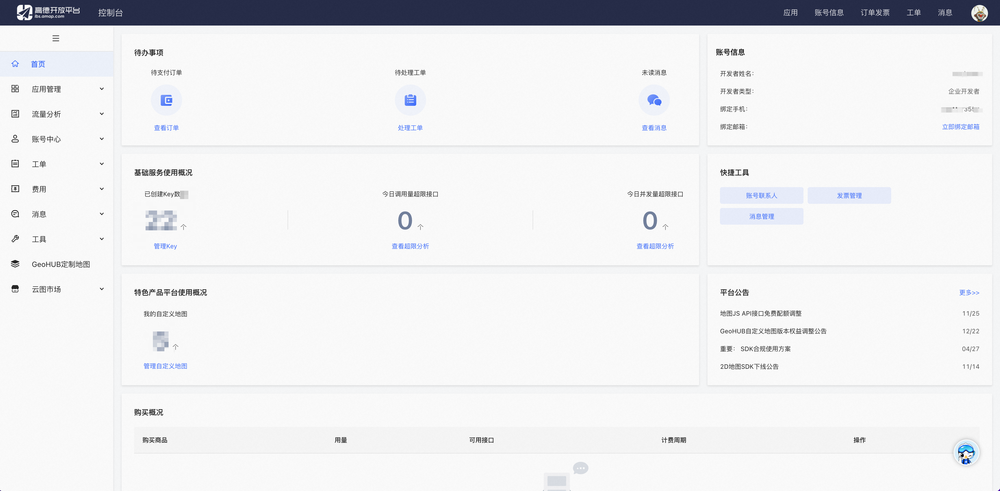
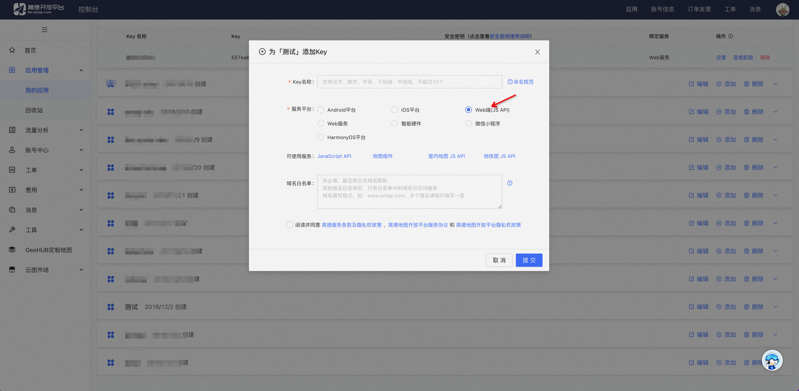
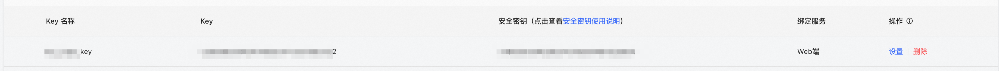
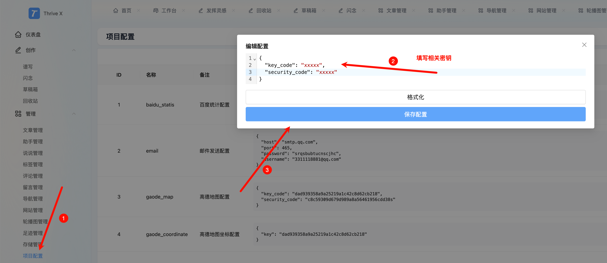
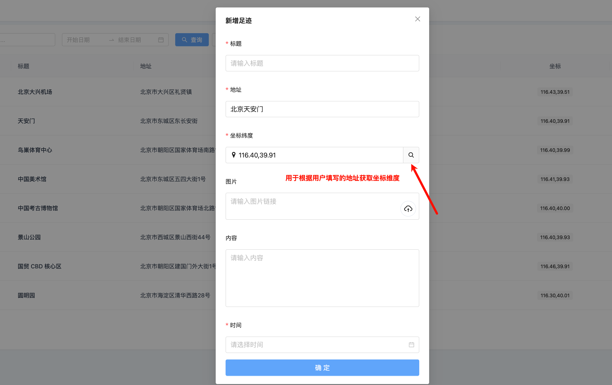
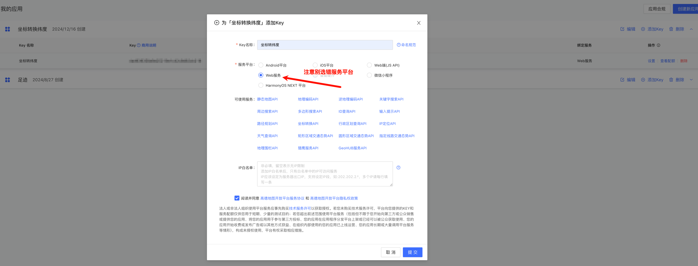
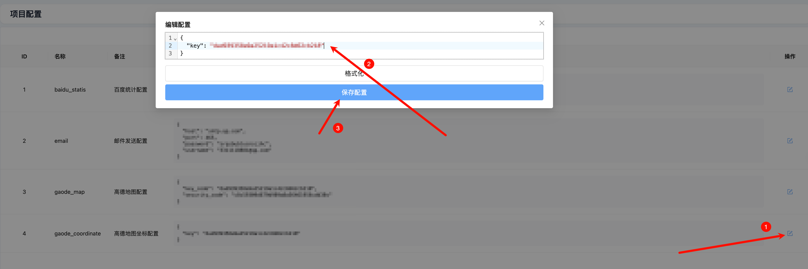
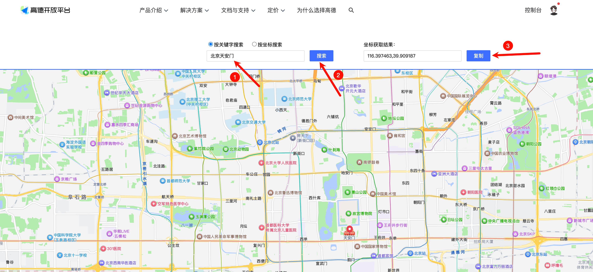

# 高德地图

## 足迹地图功能

用于前端（ThriveX-Blog）的足迹地图展示。

大家可以根据如下步骤申请 `key` 和 秘钥

### 一、登录控制台

登录 [高德开放平台控制台](https://console.amap.com/)，如果没有开发者账号，请 [注册开发者](https://console.amap.com/dev/id)。

### 二、创建 key

进入**应用管理**，**创建新应用，**新应用中**添加key** ，服务平台选择 **Web端(JS API)。**

**补充：** 域名白名单大家别忘记配置一下，不然可能会导致秘钥被别人盗用

### 三、获取 key 和密钥

创建成功后，可获取 **key** 和**安全密钥**。

### 四、配置环境变量

在控制端 管理/项目配置 中选择高德地图配置，然后按照图片配置相关信息

## 坐标维度功能

用于管理端（ThriveX-Admin）的坐标维度获取

### 一、登录控制台

方法跟什么一样

### 二、创建并获取 key

进入**应用管理**，**创建新应用，**新应用中**添加key** ，跟上面步骤不同的是这里服务平台选择 **Web服务** !!! 千万别选错

### 三、配置环境变量

在控制端 管理/项目配置 中选择高德地图配置，然后按照图片配置相关信息

### 四、手动获取坐标

如果你不想使用 `API`，也可以手动获取坐标：https://lbs.amap.com/tools/picker

填写你的坐标位置，然后点击搜索右侧表单会出现对应的坐标维度，复制后在控制端新增足迹表对应的表单里粘贴使用

