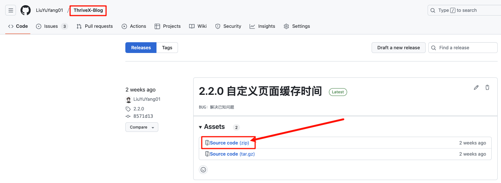
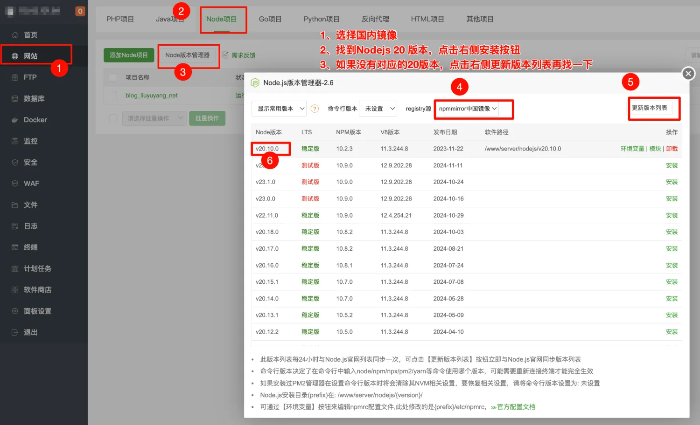
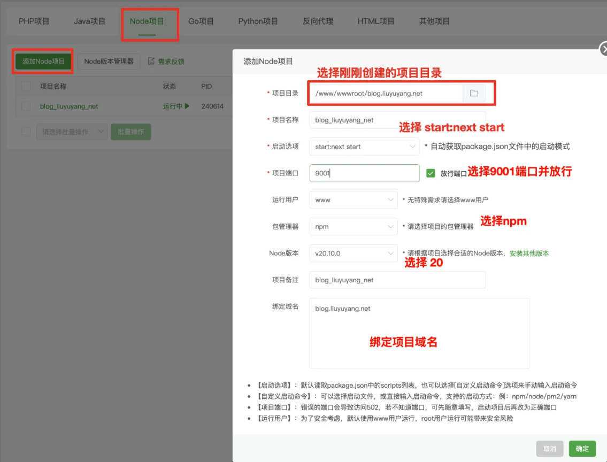

# 前端部署

本教程将以三种方式进行项目部署，分别是：宝塔、Vercel、Docker，下面直接进入主题

## 宝塔部署

**1、下载项目，配置相关信息，打包**

前端项目地址：[https://github.com/LiuYuYang01/ThriveX-Blog/releases](https://github.com/LiuYuYang01/ThriveX-Blog/releases) 

下载最新版 `Source code`

因为前端技术栈为 `Nextjs`，所以在打包时候体积非常非常大，在 `GitHub`平台上传不了这么大的文件且因为网络问题可能会导致下载失败。所以这里大家将项目下载到本地，用编辑器打开，配置后端域名然后自行打包。

本地环境：`Nodejs18+`

参考：[高德地图API申请教程](https://docs.liuyuyang.net/docs/%E9%A1%B9%E7%9B%AE%E9%83%A8%E7%BD%B2/API/%E9%AB%98%E5%BE%B7%E5%9C%B0%E5%9B%BE.html)

**2、将项目上传到服务器**

将刚刚打包生成的 `.next`和根目录的`package.json`、`package-lock.json` 这些文件上传到服务器

**3、安装 Nodejs 环境**

+ 选择国内镜像 
+ 找到 `Nodejs 20` 版本，点击右侧安装按钮 
+ 如果没有对应的`20`版本，点击右侧更新版本列表再找一下

**4、创建项目**

**5、访问项目**

[https://blog.liuyuyang.net/](https://blog.liuyuyang.net/)

## Vercel

持续更新

## Docker 部署

持续更新

## 交流群

加微信进群：`liuyuyang2023`

拒绝白嫖，问问题先点 `Star` + `Fork`，感谢支持！

技术支持 `50` 元不议价，包含（远程安装 + `3` 天内答疑服务）