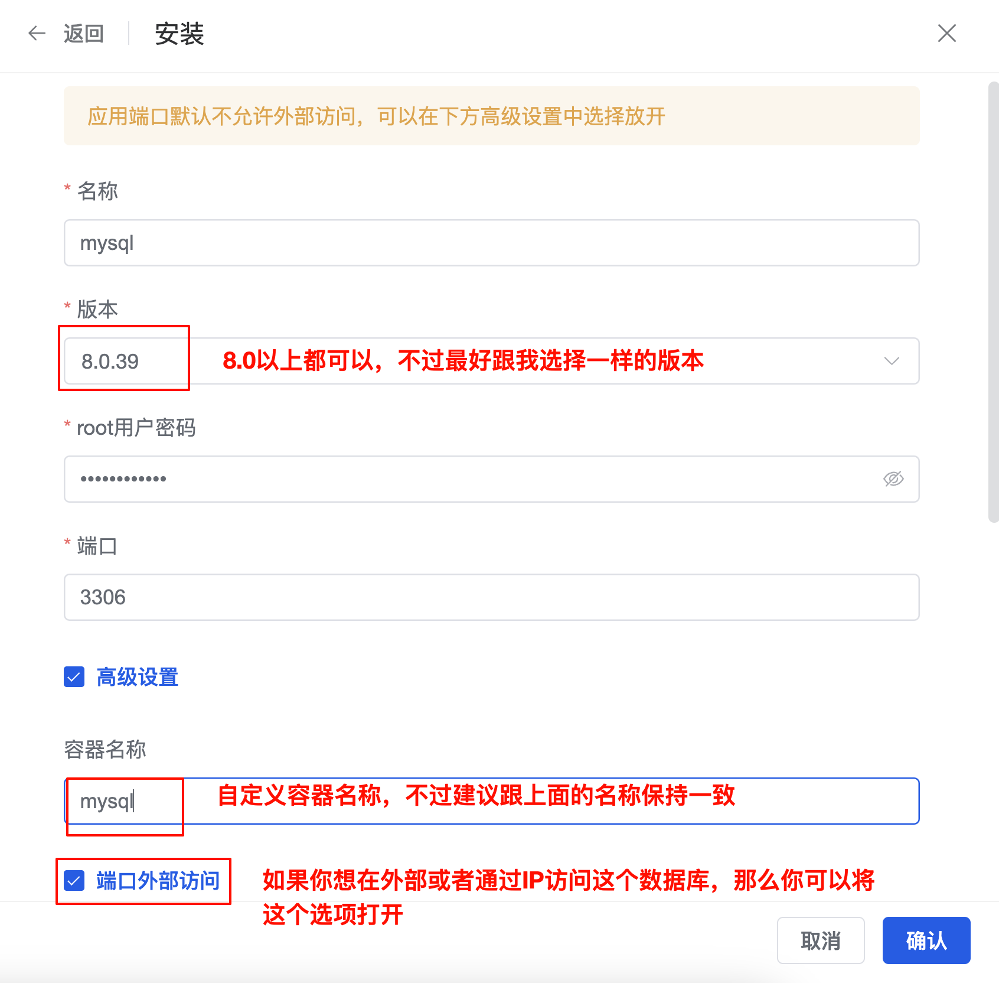
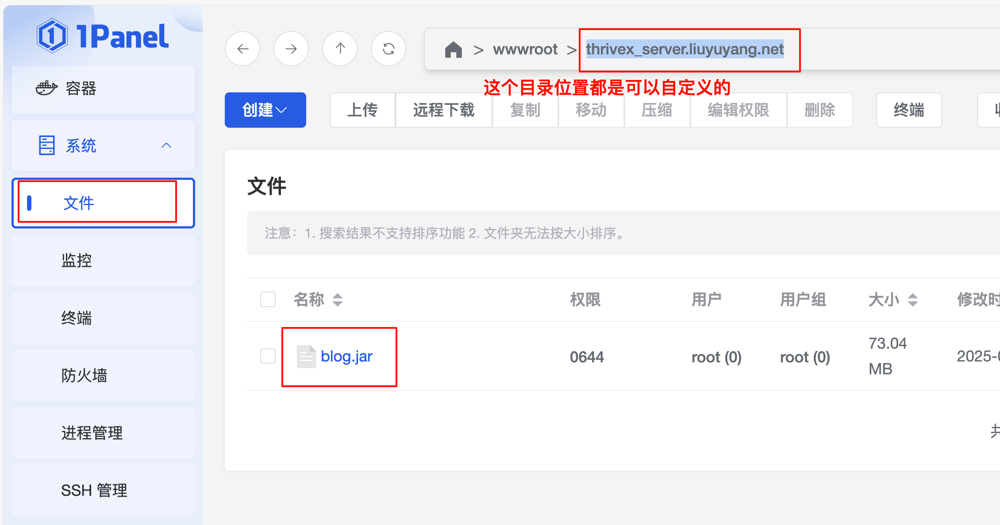
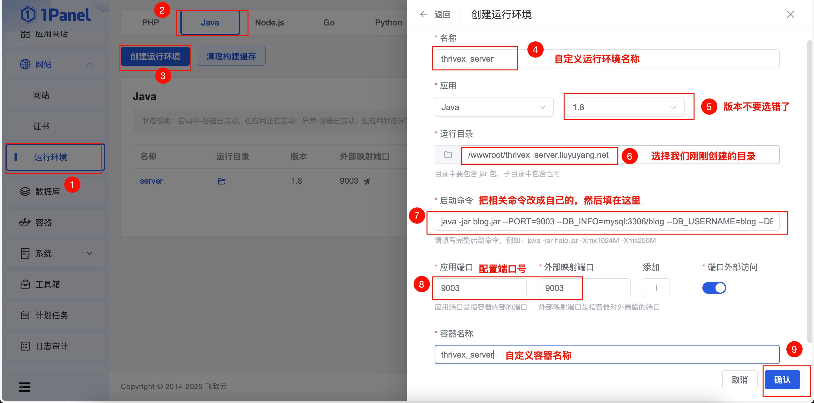
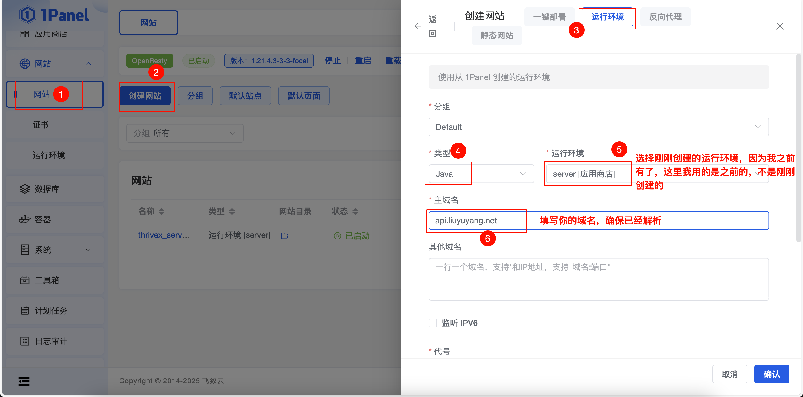
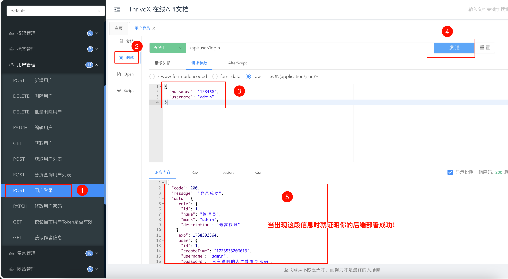
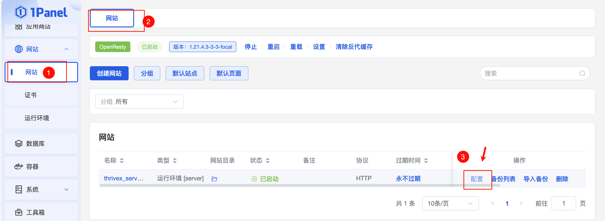
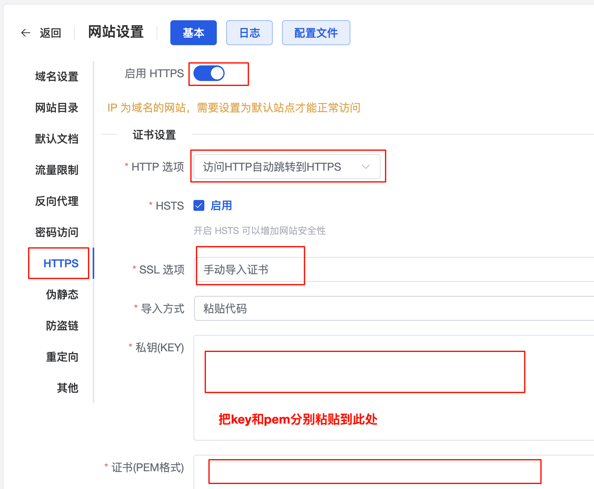

# 后端部署

本教程将以三种方式进行项目部署，分别是：宝塔、1Panel、Docker，下面直接进入主题


## 宝塔

**1、打开项目地址：** [https://github.com/LiuYuYang01/ThriveX-Server/releases](https://github.com/LiuYuYang01/ThriveX-Server/releases)

点击下载 `blog.jar` 包


**2、在软件商店安装以下应用，注意版本号！！！**


**3、添加数据库**


**4、下载并导入数据库**

数据库地址：[https://github.com/LiuYuYang01/ThriveX-Server/blob/master/ThriveX.sql](https://github.com/LiuYuYang01/ThriveX-Server/blob/master/ThriveX.sql)

点击右侧下载按钮下载数据库文件


导入刚刚数据库文件


**5、打开安装 Java 相关环境**


**6、将刚刚下载的 jar 包上传到宝塔任意目录，最好是放在 www/wwwroot/项目域名 规范一些**


**7、点击网站菜单 -> Java项目 -> 添加Java项目 选择刚刚创建的项目目录，然后配置环境变量**

```bash
PORT=自定义项目端口号
DB_INFO=数据库信息
DB_USERNAME=数据库用户名，一般root
DB_PASSWORD=数据库密码
EMAIL_HOST=邮箱服务器
EMAIL_PORT=邮箱服务器端口
EMAIL_USERNAME=邮箱用户名
EMAIL_PASSWORD=邮箱授权码（不是邮箱密码）
DOMAIN=你的域名（三端需要是同一个顶级域名）
```

**示例：**

```bash
PORT=9003
DB_INFO=localhost:3306/blog
DB_USERNAME=root
DB_PASSWORD=YFWyPwW2tNw7a3Bz
EMAIL_HOST=smtp.qq.com
EMAIL_PORT=465
EMAIL_USERNAME=3311118881@qq.com
EMAIL_PASSWORD=eqtadasdasdadqhcjdi
DOMAIN=https://*.liuyuyang.net
```

图中只做参考，具体看示例。（作者最近太忙，抽空更新一下！）

（2024 年12月10日）最新调整，环境变量需要新增 `PORT=9003`，手动指定端口号

（2024 年12月23日）`DB_NAME` 环境变量已被调整为：`DB_INFO`

（2025 年1月18日）去除 `OSS_` 相关环境变量配置

（2025 年4月27日）新增 `DOMAIN` 配置


**8、测试是否部署成功**

如果访问 `ip:9003` 网页出现如下文本表示后端部署成功


进一步测试，访问 [http://110.42.101.84:9003/doc.html#/default/用户管理/loginUsingPOST](http://110.42.101.84:9003/doc.html#/default/%E7%94%A8%E6%88%B7%E7%AE%A1%E7%90%86/loginUsingPOST) 进行登录

默认账号：admin     密码：123456


**9、绑定域名**


**10、配置 ssl 证书**

申请证书成功后会返回 `key` 和 `pem` 的秘钥，分别粘贴到指定位置即可


## 1Panel

**1、下载程序**

打开项目地址：[https://github.com/LiuYuYang01/ThriveX-Server/releases](https://github.com/LiuYuYang01/ThriveX-Server/releases)

点击下载 `blog.jar` 包，下载最新版，当前版本为 `2.1.5`。后续会有更新，下载最新的就行


**2、安装相关环境**

在应用商店安装以下应用，注意版本号！！！


其他两个环境的版本随便选应该都没事，影响不大。

就拿安装 `mysql` 作为示例， `8.0` 以上版本都可以，不过建议跟我选择一样的。

容器名称也可以自定义，这里我定义为：`mysql`。待会需要跟后端连接使用。




最后一个需要安装的是 `phpmyadmin`，它是一个可视化数据库操作的网站，大家可以自由选择安装，不做强制要求。

最好安装下，管理数据库还是很方便的


**3、下载数据库**

数据库地址：[https://github.com/LiuYuYang01/ThriveX-Server/blob/master/ThriveX.sql](https://github.com/LiuYuYang01/ThriveX-Server/blob/master/ThriveX.sql)

点击右侧下载按钮下载数据库文件


**4、导入数据库**


**4、将刚刚下载的 `blog.jar` 上传到服务器**




**4、创建项目**

启动命令介绍：

```env
PORT=自定义项目端口号
DB_INFO=数据库信息
DB_USERNAME=数据库用户名，一般root
DB_PASSWORD=数据库密码
EMAIL_HOST=邮箱服务器
EMAIL_PORT=邮箱服务器端口
EMAIL_USERNAME=邮箱用户名
EMAIL_PASSWORD=邮箱授权码（不是邮箱密码）
DOMAIN=你的域名（三端需要是同一个顶级域名）
```

示例：

```
java -jar blog.jar --PORT=9003 --DB_INFO=mysql:3306/blog --DB_USERNAME=blog --DB_PASSWORD=123123 --EMAIL_HOST=smtp.qq.com --EMAIL_PORT=465 --EMAIL_USERNAME=3311118881@qq.com --EMAIL_PASSWORD=abcdefg --DOMAIN=https://*.liuyuyang.net
```




**5、创建网站**




**6、测试**

访问 `API` 调试网站进行登录测试：`你的域名/doc.html`  




**7、最后一步，配置 `HTTPS`** 



至于如何申请证书这里就不多解释了，自行百度一下



## Docker 

持续更新


## 交流群

不定时会有热心网友免费技术支持哦！

加微信：`liuyuyang2023`   记得备注：拉群

