# 后端部署

本教程将以三种方式进行项目部署，分别是：宝塔、1Panel、Docker，下面直接进入主题


## 宝塔部署

**1、打开项目地址：** [https://github.com/LiuYuYang01/ThriveX-Server/releases](https://github.com/LiuYuYang01/ThriveX-Server/releases)

点击下载 `blog.jar` 包


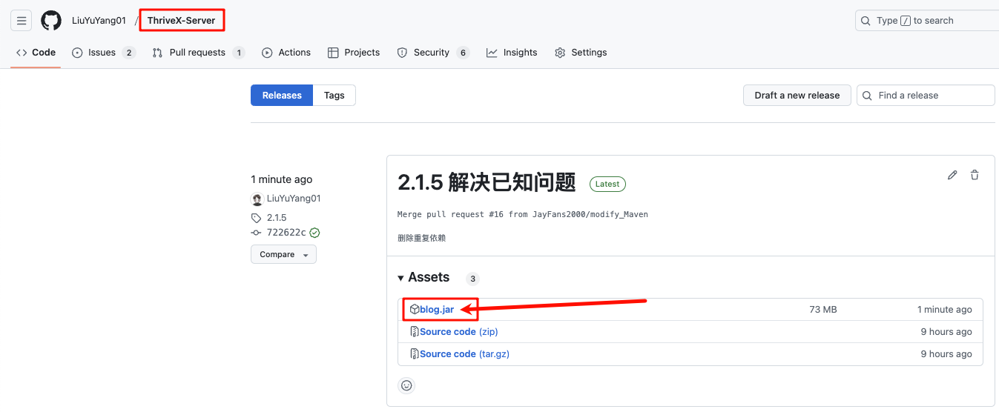


**2、在软件商店安装以下应用，注意版本号！！！**

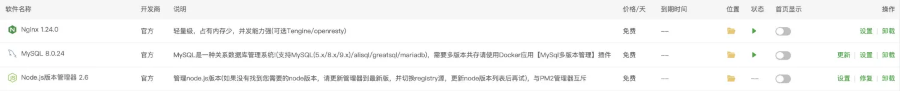


**3、添加数据库**

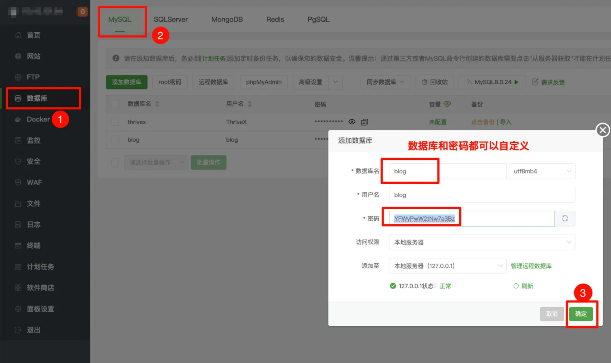


**4、下载并导入数据库**

数据库地址：[https://github.com/LiuYuYang01/ThriveX-Server/blob/master/ThriveX.sql](https://github.com/LiuYuYang01/ThriveX-Server/blob/master/ThriveX.sql)

点击右侧下载按钮下载数据库文件


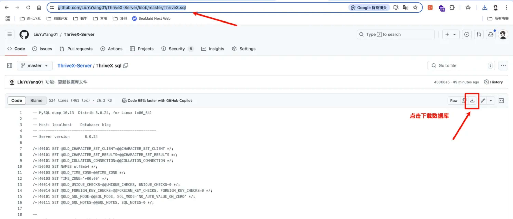

导入刚刚数据库文件


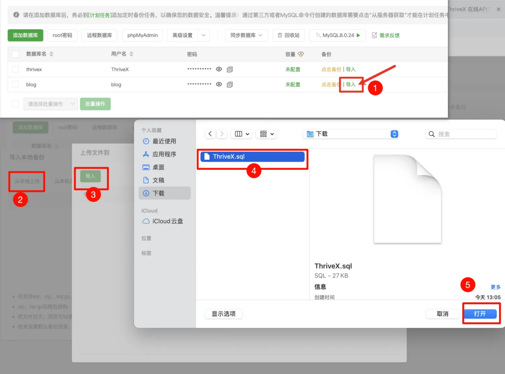


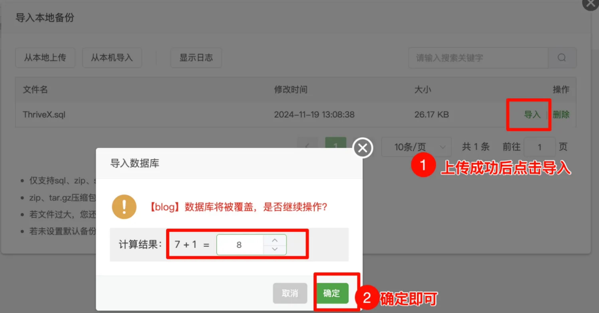


**5、打开安装 Java 相关环境**

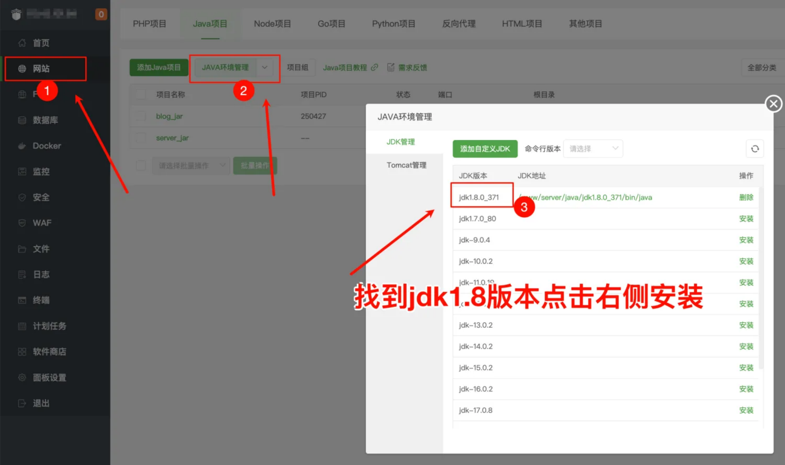


**6、将刚刚下载的 jar 包上传到宝塔任意目录，最好是放在 www/wwwroot/项目域名 规范一些**


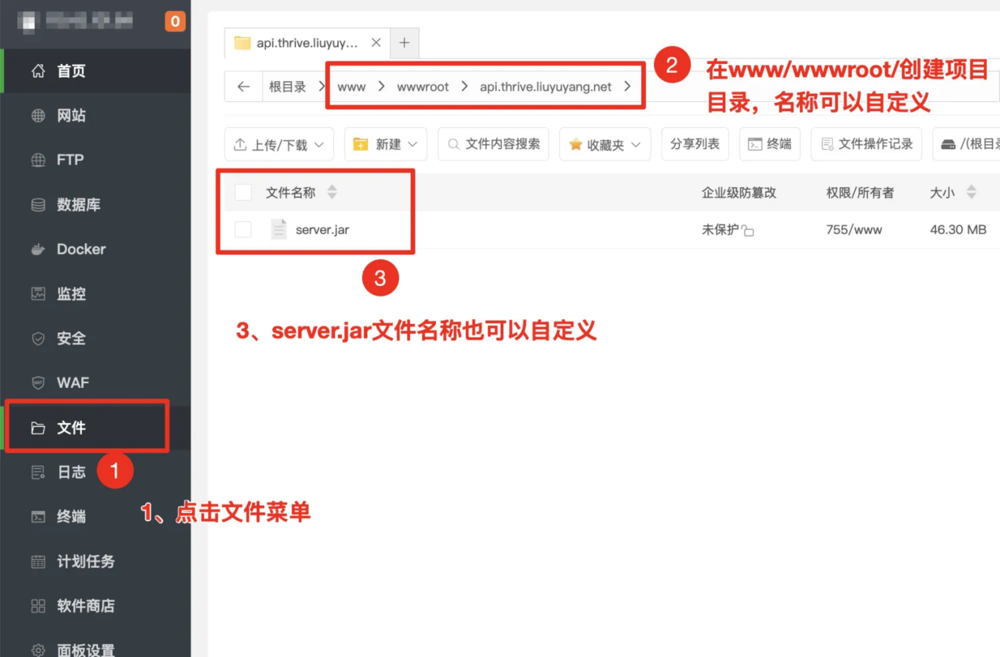


**7、点击网站菜单 -> Java项目 -> 添加Java项目 选择刚刚创建的项目目录，然后配置环境变量**

```bash
PORT=自定义项目端口号
DB_INFO=数据库信息
DB_USERNAME=数据库用户名，一般root
DB_PASSWORD=数据库密码
EMAIL_HOST=邮箱服务器
EMAIL_PORT=邮箱服务器端口
EMAIL_USERNAME=邮箱用户名
EMAIL_PASSWORD=邮箱授权码（不是邮箱密码）
```

**示例：**

```bash
PORT=9003
DB_INFO=localhost:3306/blog
DB_PASSWORD=YFWyPwW2tNw7a3Bz
EMAIL_HOST=smtp.qq.com
EMAIL_PORT=465
EMAIL_USERNAME=3311118881@qq.com
EMAIL_PASSWORD=eqtadasdasdadqhcjdi
```

图中只做参考，具体看示例。（作者最近太忙，抽空更新一下！）

（12月10日）最新调整，环境变量需要新增PORT=9003，手动指定端口号

（12月23日）DB_NAME环境变量已被调整为：DB_INFO

（1月18日）去除OSS_相关环境变量配置

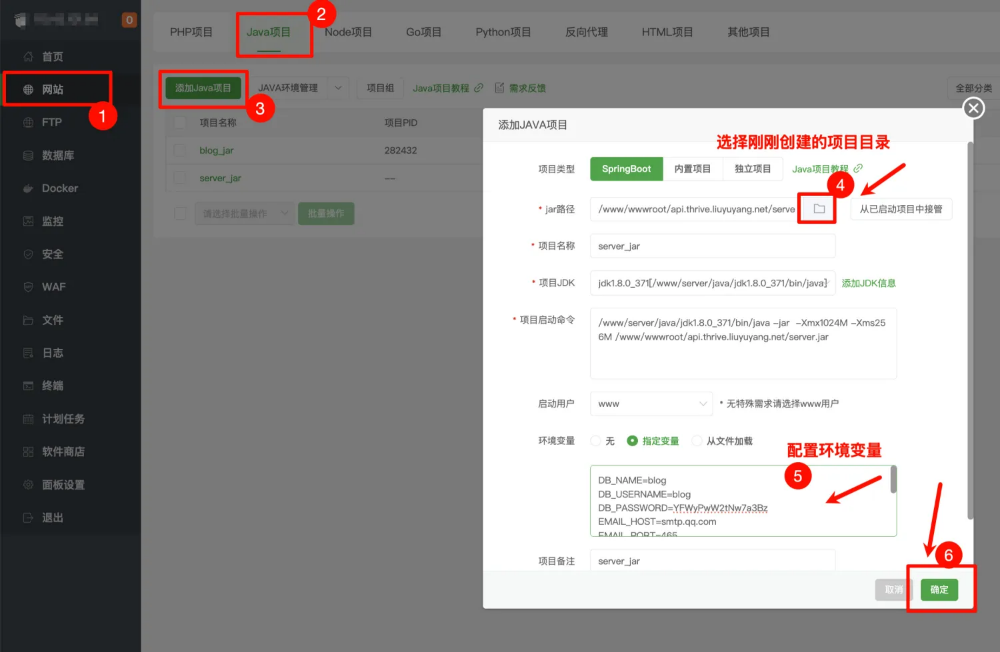


**8、测试是否部署成功**

如果访问 `ip:9003` 网页出现如下文本表示后端部署成功


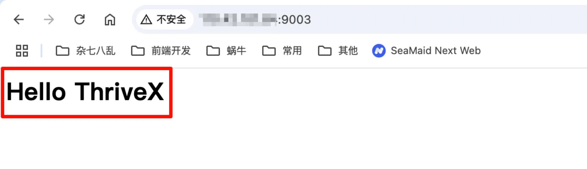

进一步测试，访问 [http://110.42.101.84:9003/doc.html#/default/用户管理/loginUsingPOST](http://110.42.101.84:9003/doc.html#/default/%E7%94%A8%E6%88%B7%E7%AE%A1%E7%90%86/loginUsingPOST) 进行登录

默认账号：admin     密码：123456

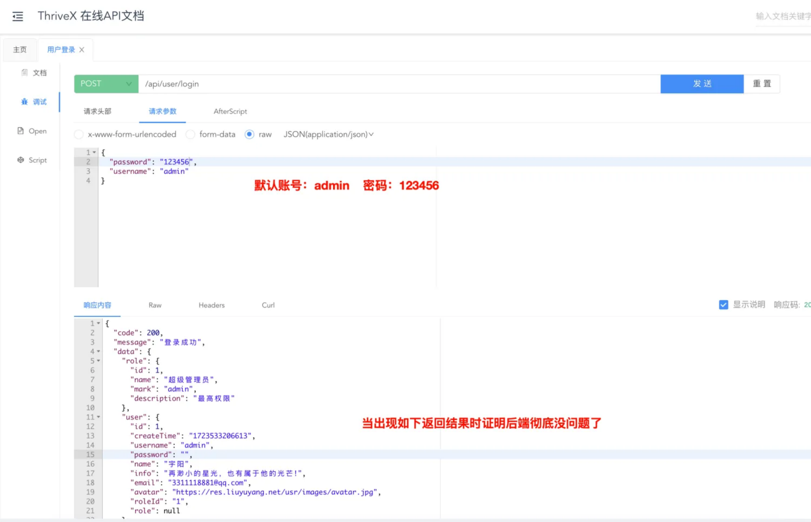


**9、绑定域名**

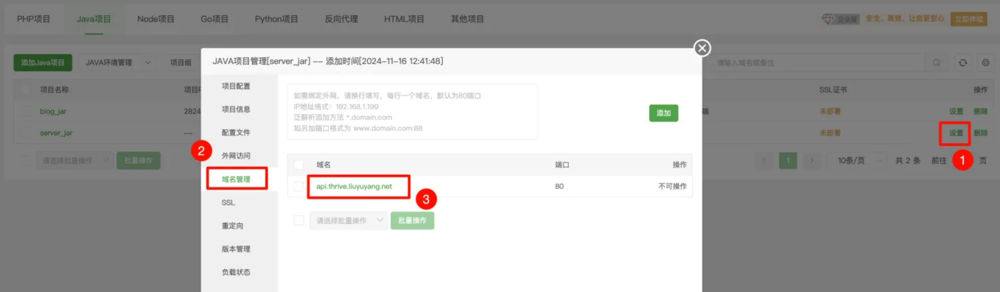


**10、配置 ssl 证书**

申请证书成功后会返回 `key` 和 `pem` 的秘钥，分别粘贴到指定位置即可

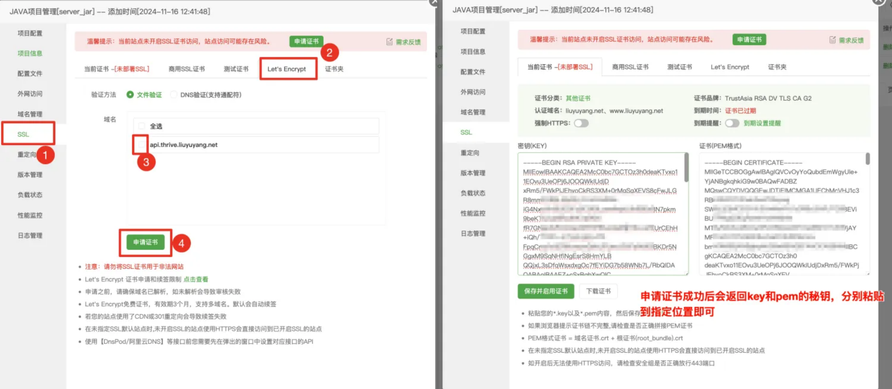


## 1Panel（还没写完，勿看）

**1、打开项目地址：** [https://github.com/LiuYuYang01/ThriveX-Server/releases](https://github.com/LiuYuYang01/ThriveX-Server/releases)

点击下载 `blog.jar` 包


**2、在应用商店安装以下应用，注意版本号！！！**

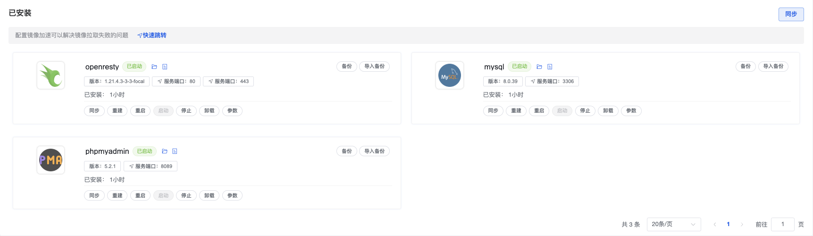


**3、下载数据库**

数据库地址：[https://github.com/LiuYuYang01/ThriveX-Server/blob/master/ThriveX.sql](https://github.com/LiuYuYang01/ThriveX-Server/blob/master/ThriveX.sql)

点击右侧下载按钮下载数据库文件


**4、导入数据库**

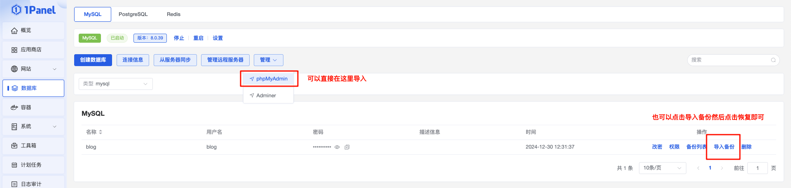

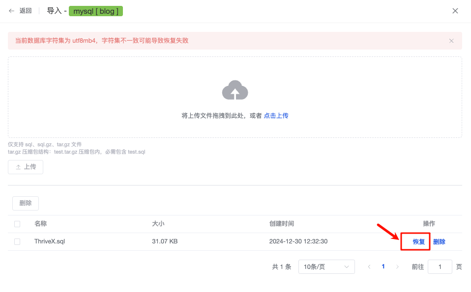


**4、将刚刚下载的 `blog.jar` 上传到服务器**

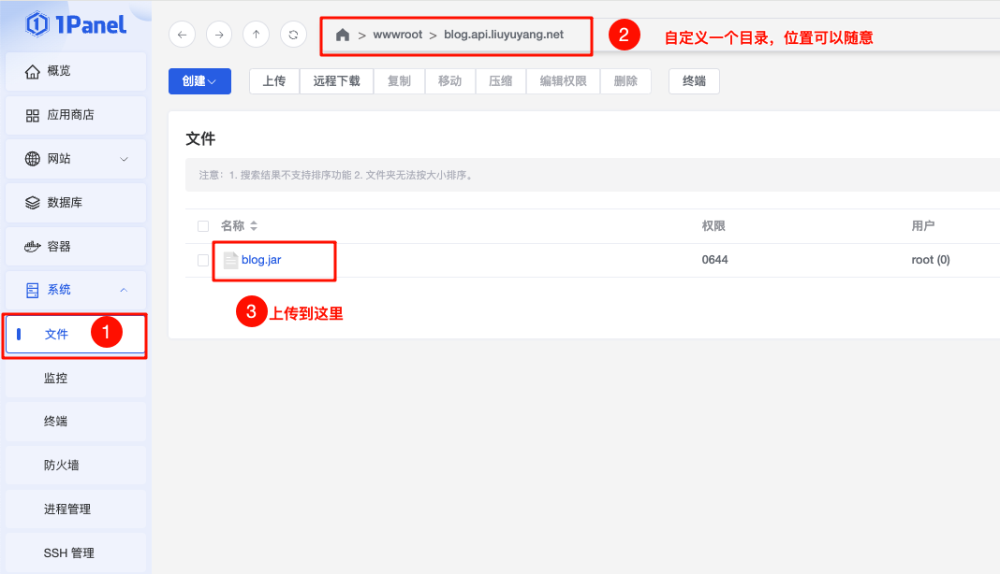


**4、创建项目**

启动命令介绍：

```
PORT=自定义项目端口号
DB_INFO=数据库信息
DB_USERNAME=数据库用户名，一般root
DB_PASSWORD=数据库密码
EMAIL_HOST=邮箱服务器
EMAIL_PORT=邮箱服务器端口
EMAIL_USERNAME=邮箱用户名
EMAIL_PASSWORD=邮箱授权码（不是邮箱密码）
```

示例：

```
java -jar blog.jar --PORT=9003 --DB_INFO=localhost:3306/blog --DB_PASSWORD=abcdefg --EMAIL_HOST=smtp.qq.com --EMAIL_PORT=465 --EMAIL_USERNAME=3311118881@qq.com --EMAIL_PASSWORD=abcdefg
```

**注意：** 图中DB_NAME环境变量已被调整为：DB_INFO，并且去除了OSS_相关环境变量配置。图中只做参考，具体看示例。（作者最近太忙，抽空更新一下！）

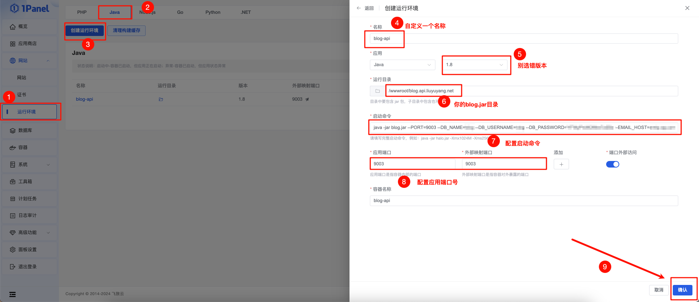


**5、创建网站**

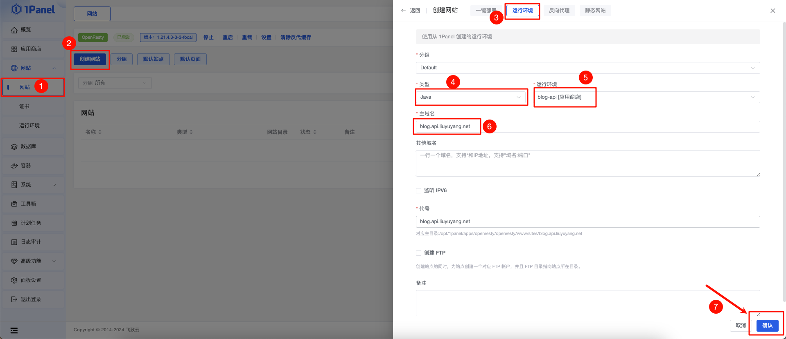


## Docker 部署

持续更新


## 交流群

加微信进群：`liuyuyang2023`

拒绝白嫖，问问题先点 `Star` + `Fork`，感谢支持！ 

技术支持 `50` 元不议价，包含（远程安装 + `3` 天内答疑服务）