# 进入主题

## 后端

### 下载源码

**访问：** [https://github.com/LiuYuYang01/ThriveX-Server/releases](https://github.com/LiuYuYang01/ThriveX-Server/releases)

访问页面后，找到最新的版本然后在下方找到 `blog.jar` 下载 

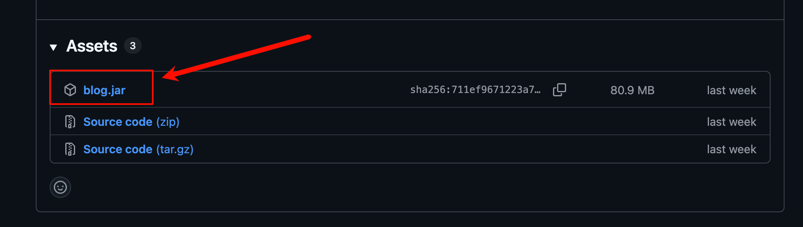


### 下载 SQL

**SQL 文件：** https://github.com/LiuYuYang01/ThriveX-Server/blob/master/ThriveX.sql

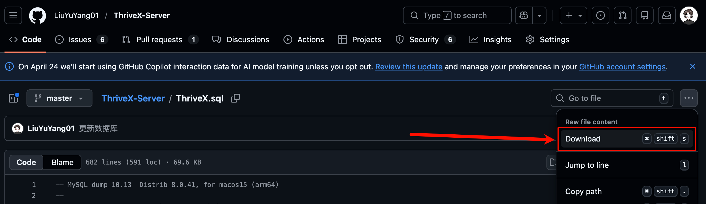


### 上传源码

进入宝塔点击左侧菜单：**文件**，进入到 `/www/wwwroot` 目录，然后点击新建文件夹，文件夹名称自定义

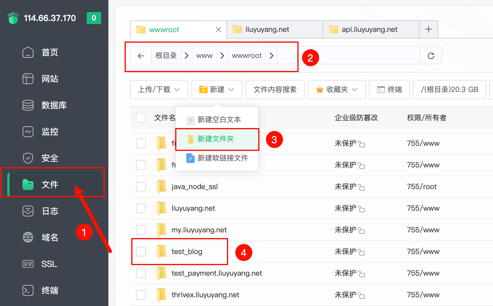

创建完成后进入到这个文件夹，点击上传按钮把刚刚下载的 `blog.jar` 上传到这里

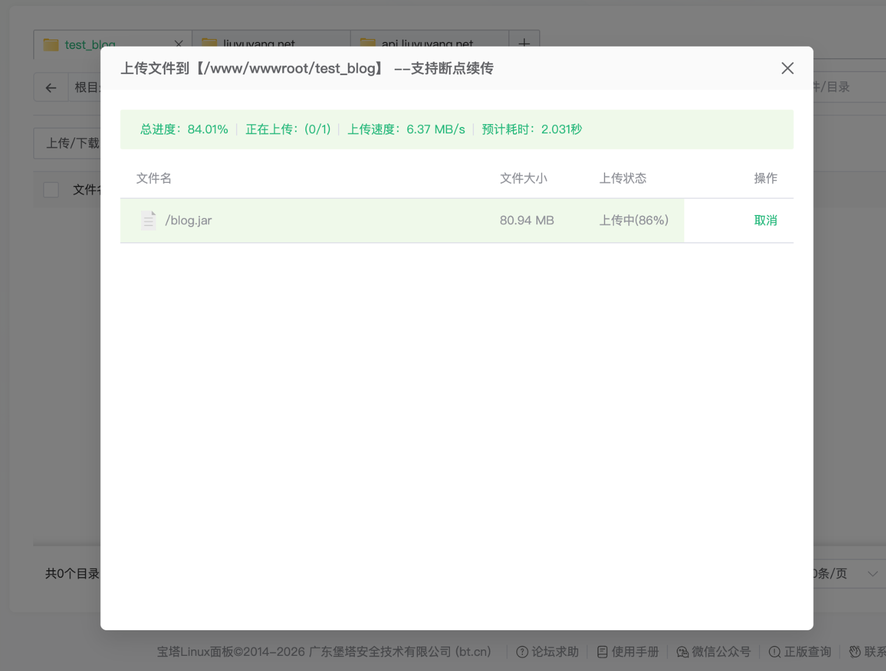


### 配置数据库

进入宝塔点击左侧菜单：**数据库**，然后点击添加数据库按钮，数据库名称和密码建议复杂些

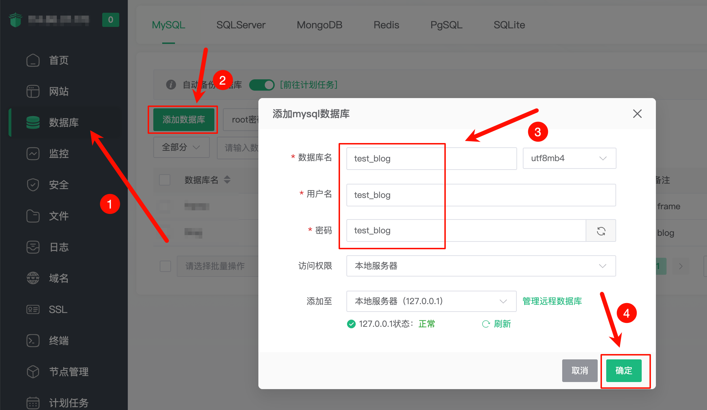


导入刚刚下载的 `ThriveX.sql` 文件到刚刚创建的数据库中

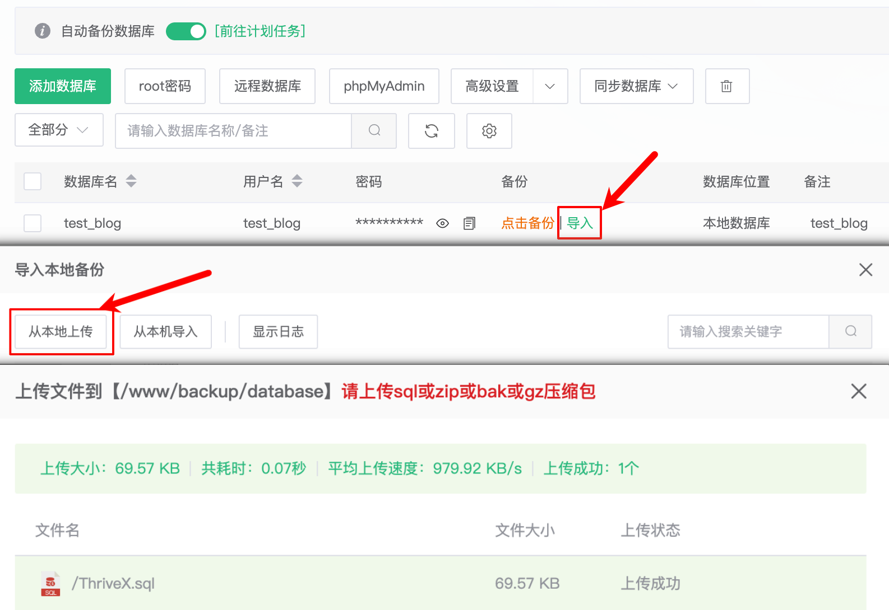

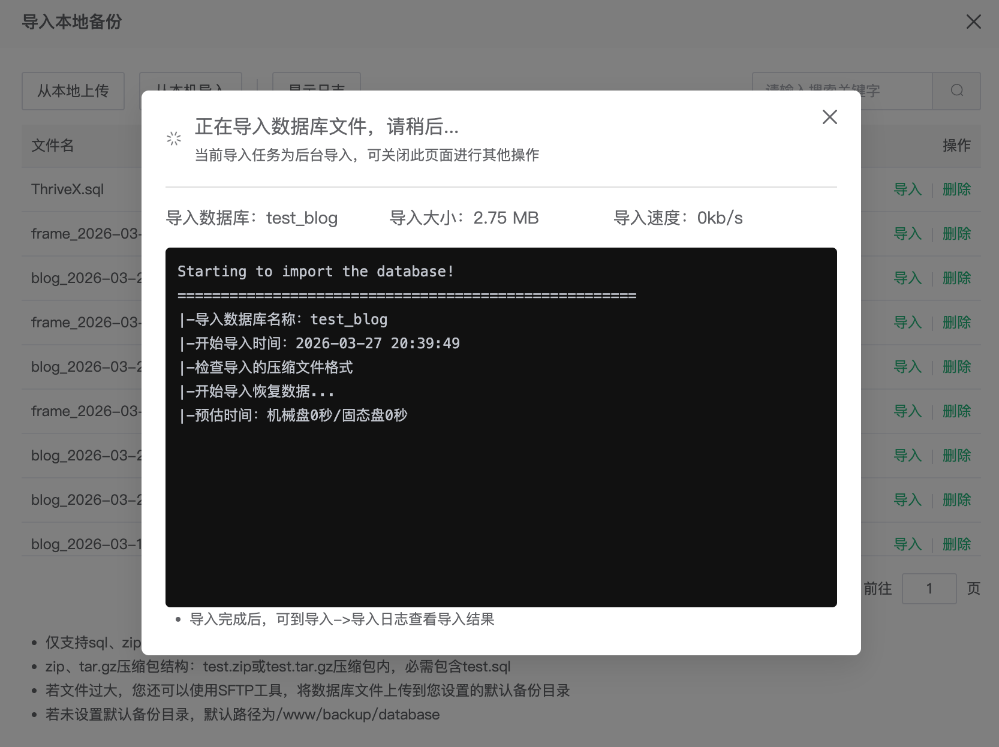


### 配置 Java 环境

一、进入宝塔点击左侧菜单：**网站**，点击添加项目按钮

二、点击添加 `JDK` 信息按钮

三、找到 `JDK1.8` 版本 点击右侧安装按钮，注意这里版本不要安装错

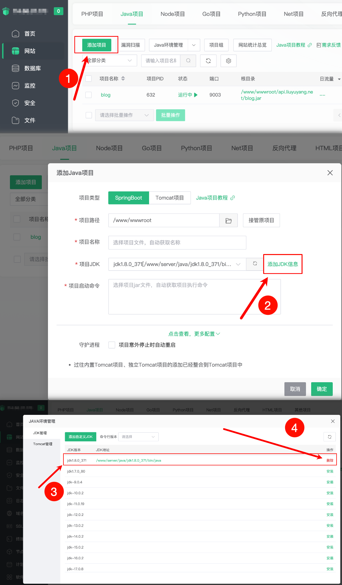


### 创建网站

一、选择之前创建的 `test_blog` 文件夹

二、在当前文件夹选择 `blog.jar` 点击右下角的确定按钮

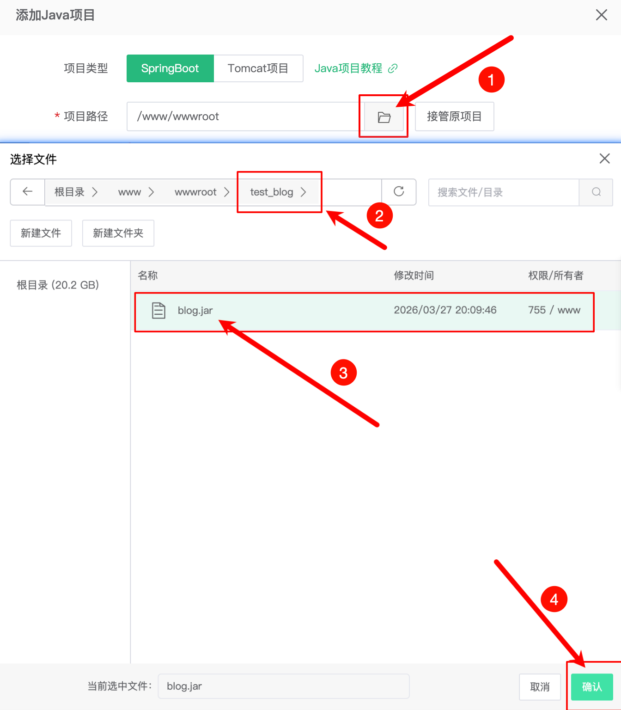

配置项目端口号与环境变量

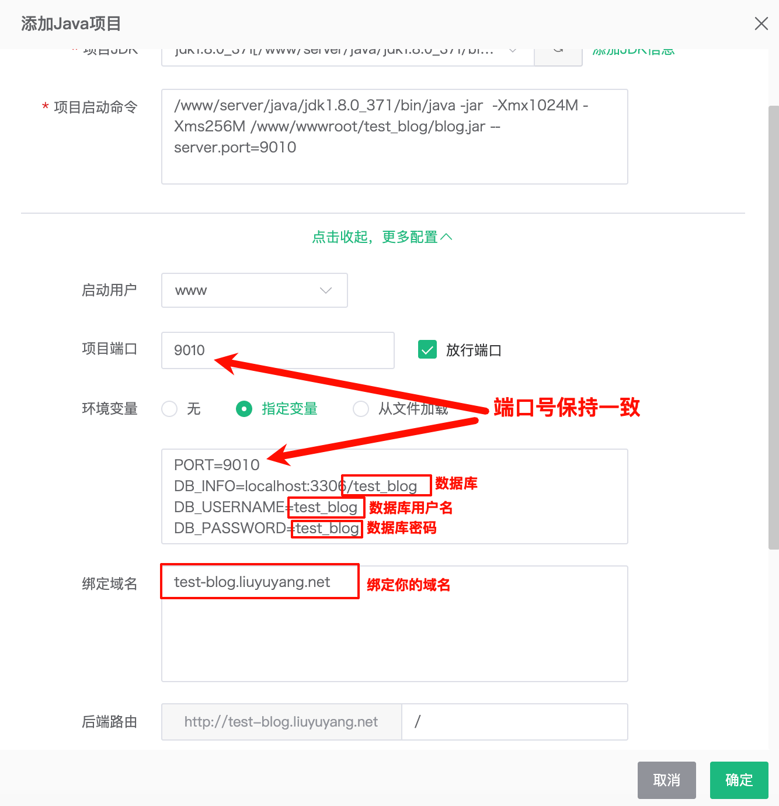

环境变量介绍

```
PORT=自定义项目端口号
DB_INFO=数据库信息
DB_USERNAME=数据库用户名，一般是 root
DB_PASSWORD=数据库密码
```

环境变量示例

```
PORT=9010
DB_INFO=localhost:3306/blog
DB_USERNAME=test_blog
DB_PASSWORD=test_blog
```


### 验证项目是否成功

**访问：** [http://114.66.37.170:9010/doc.html](http://114.66.37.170:9010/doc.html) 选择用户管理调用用户登录接口验证是否成功，如果接口返回登录成功则表示上述操作一切顺利

默认账号：`admin`

密码：`123456`

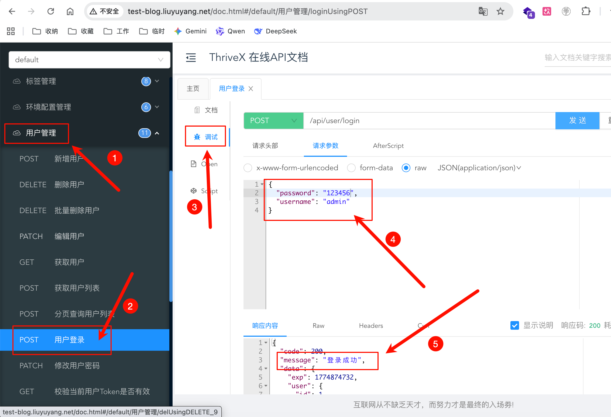


### 配置 SSL

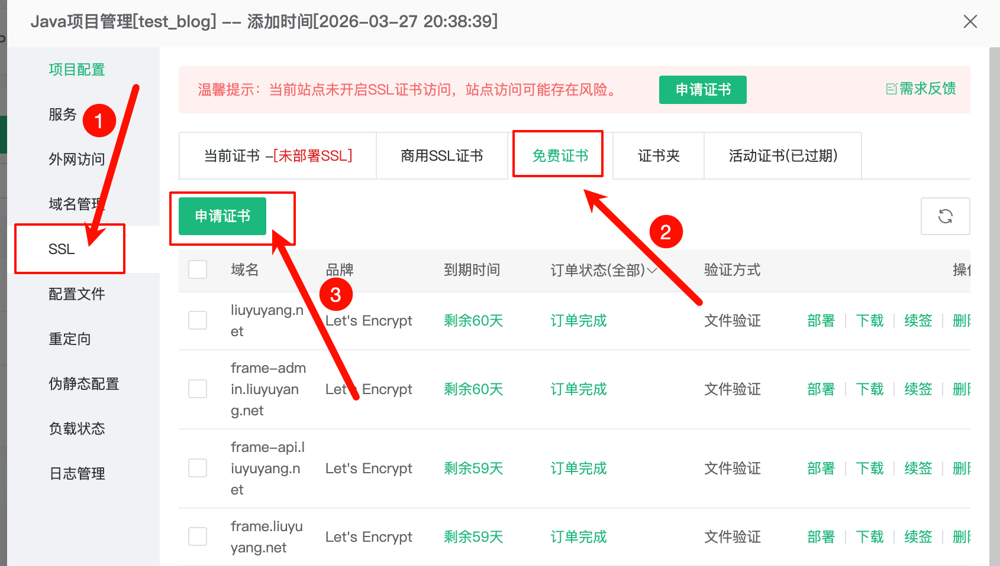

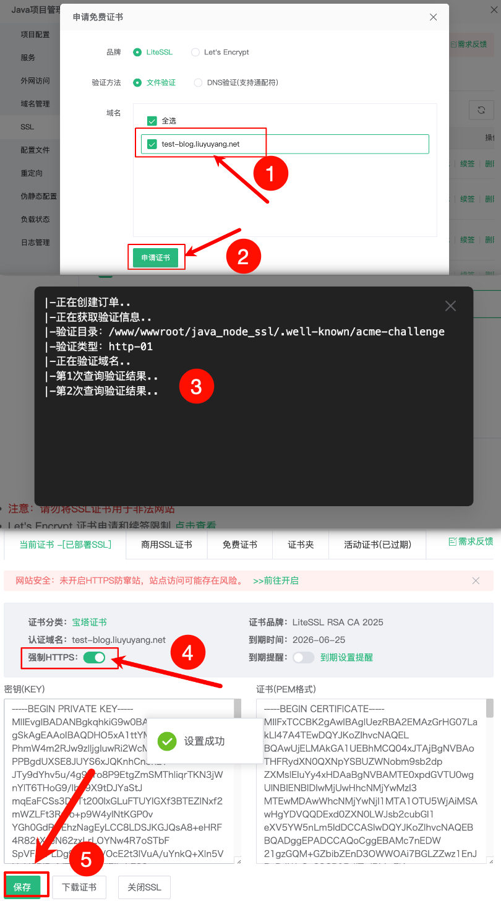

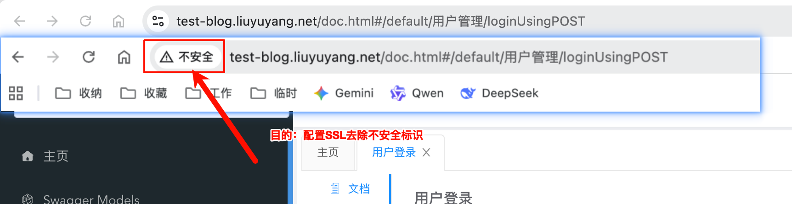

当你配置完成后刷新网站看到不安全标记消失后就表示后端部署完成


## 控制端


## 前端

