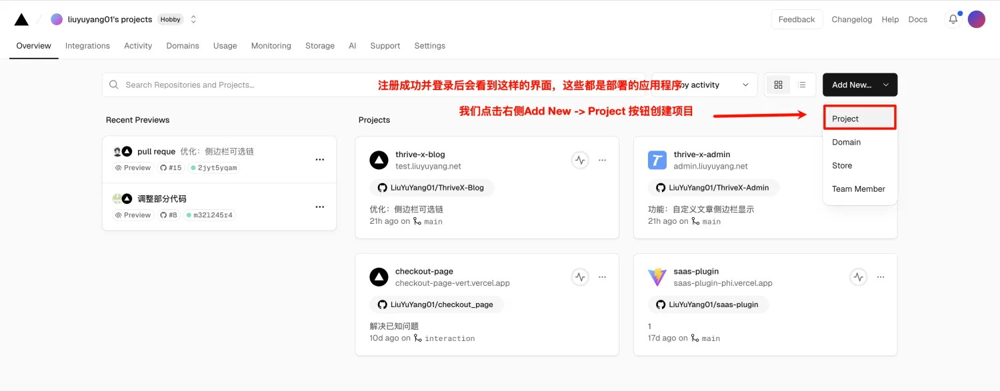
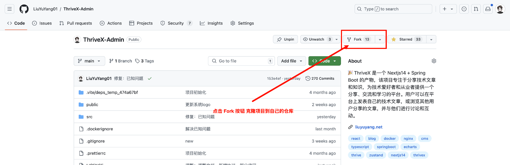
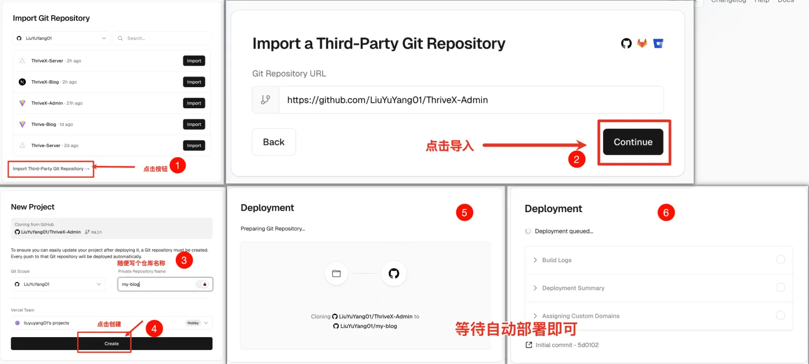
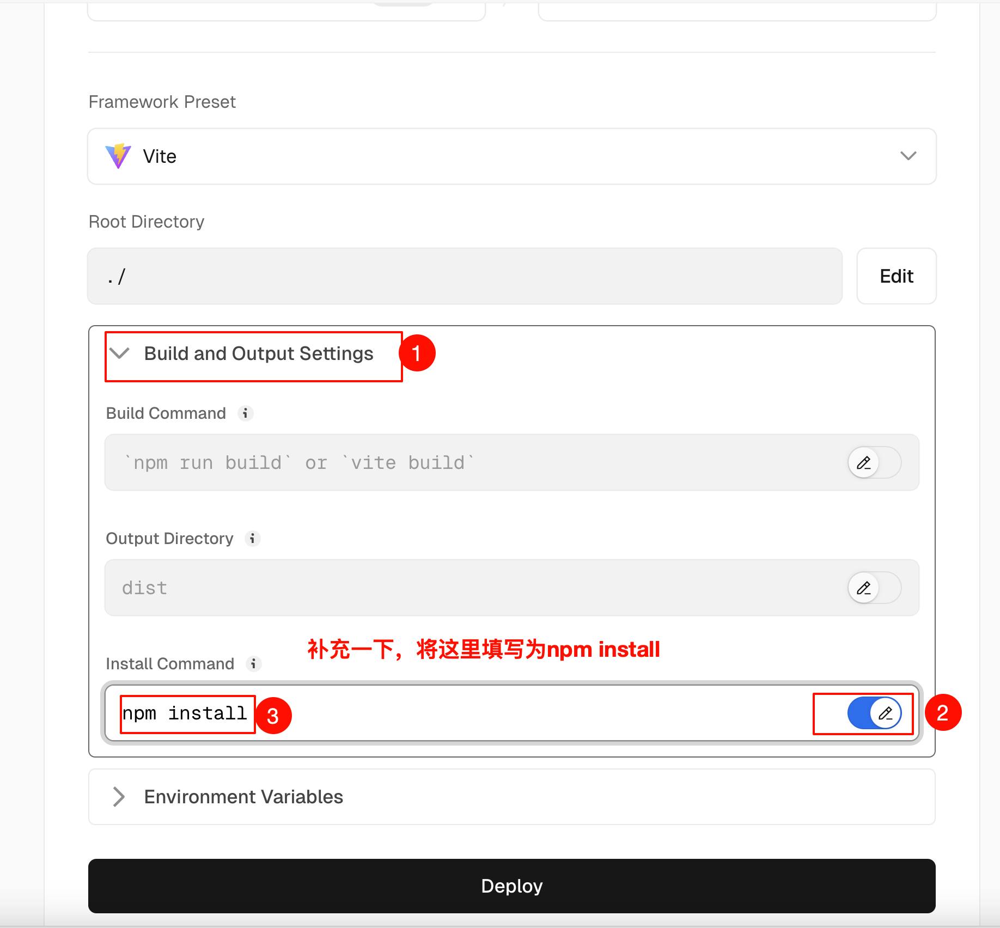
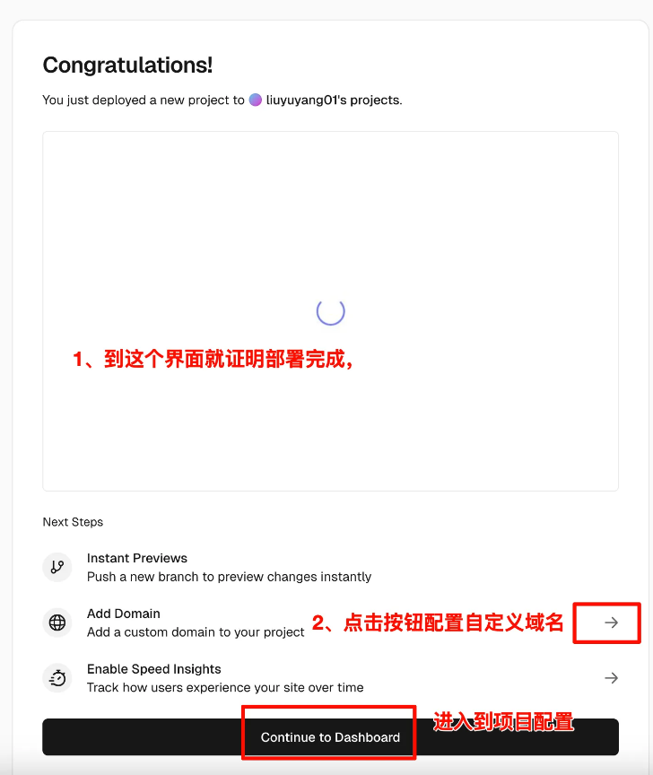
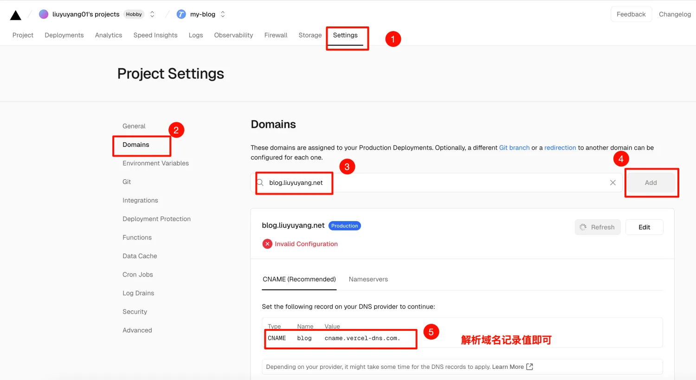
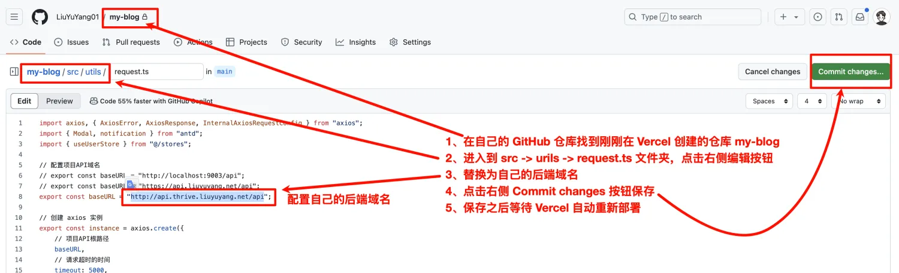
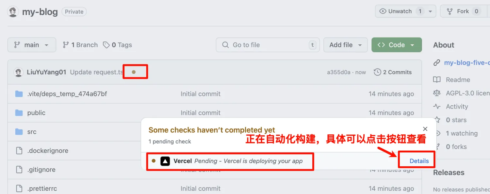
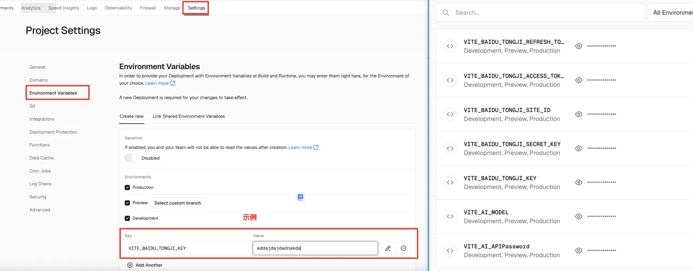
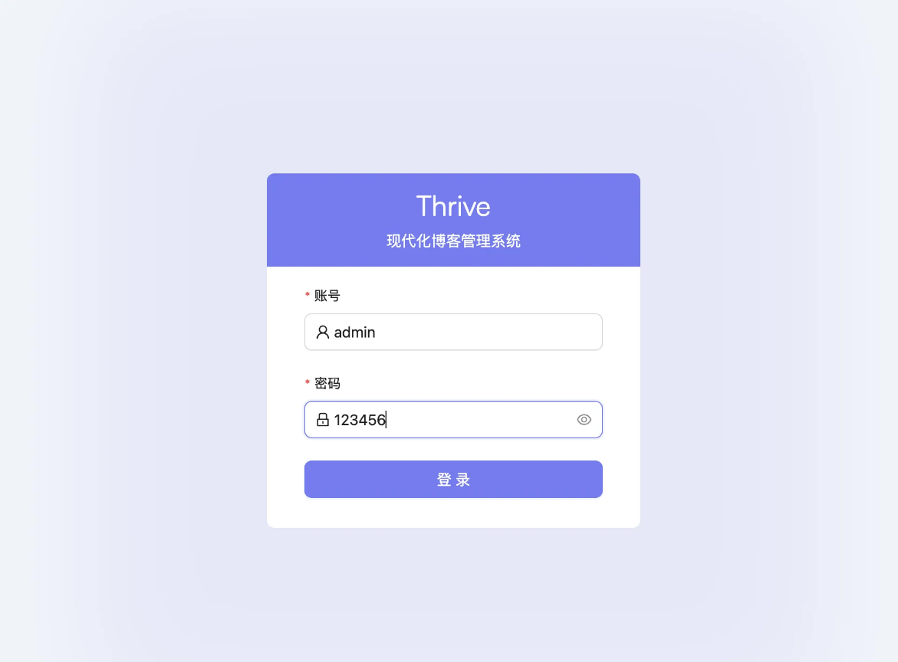

# 控制端

**特别强调：** 请先部署后端！请先部署后端！请先部署后端！

## Vercel 部署（推荐）

前端项目采用了宝塔部署，那么控制端项目我就换一种方式教大家

**1、注册 Vercel 账号**

官网：[https://vercel.com/](https://vercel.com/)   (科学上网)

注册成功并登录后会看到这样的界面，这些都是部署的应用程序

我们点击右侧 `Add New -> Project` 按钮创建项目





**2、部署项目**

控制端项目地址：[https://github.com/LiuYuYang01/ThriveX-Admin](https://github.com/LiuYuYang01/ThriveX-Admin)

2.1 点击 `Fork` 按钮 克隆项目到自己的仓库


2.2 找到刚刚 `Fork` 的项目 点击 `Import` 导入


2.3 如果不显示刚刚 `Fork` 的项目就手动导入（尽量在项目列表导入，否则后续会很麻烦），剩下的流程都是一样的




第 `3` - `4` 步之间 补充一下，点击 `Build and Output Settings` 选项展开，然后将 `Install Command` 这里填写为 `npm install`




2.4 当看到这个界面就表示部署没问题了




**3、自定义域名**

需要注意的是 `Vercel` 是国外的平台，因此部署的网站默认只能翻墙访问，但我们可以配置国内 `cdn` 解决这个文件




**4、替换为自己的后端域名**

+ 在自己的 `GitHub` 仓库找到刚刚在 `Vercel` 创建的仓库 `my-blog`
+ 进入到 `src -> urils -> request.ts` 文件夹，点击右侧编辑按钮 
+ 替换为自己的后端域名 
+ 点击右侧 `Commit changes` 按钮保存 
+ 保存之后等待 `Vercel` 自动重新部署




这里我补充一下，如果使用 `vercel` 部署，则后端域名必须是 `https`协议，图文中 `http`是错误的


接下来等待自动化部署





**5、配置环境变量**

参考：[星火大模型API申请教程](https://docs.liuyuyang.net/docs/%E9%A1%B9%E7%9B%AE%E9%83%A8%E7%BD%B2/API/%E6%98%9F%E7%81%AB%E5%A4%A7%E6%A8%A1%E5%9E%8B.html)
参考：[百度统计API申请教程](https://docs.liuyuyang.net/docs/%E9%A1%B9%E7%9B%AE%E9%83%A8%E7%BD%B2/API/%E7%99%BE%E5%BA%A6%E7%BB%9F%E8%AE%A1.html)

```bash
# 项目后端API地址
VITE_PROJECT_API=https://你的后域名:9003/api

# 百度统计相关配置（可选）
VITE_BAIDU_TONGJI_SITE_ID=
VITE_BAIDU_TONGJI_ACCESS_TOKEN=

# 星火AI相关配置（可选）
# 选择 Spark Lite 大模型，其他的是收费的
VITE_AI_APIPassword=
VITE_AI_MODEL=lite # 如果选择的是 Spark Lite 则不需要改动这里

# 高德地图Web API
VITE_GAODE_WEB_API=
```





**6、部署成功**

默认账号：admin     密码：123456





## 宝塔

持续更新


## Docker 部署

持续更新


## 交流群

不定时会有热心网友免费技术支持哦！

加微信：`liuyuyang2023`   记得备注：拉群

